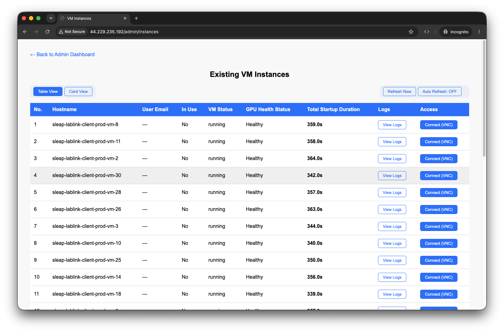
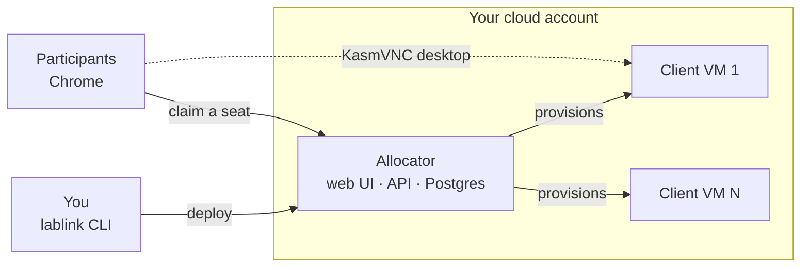
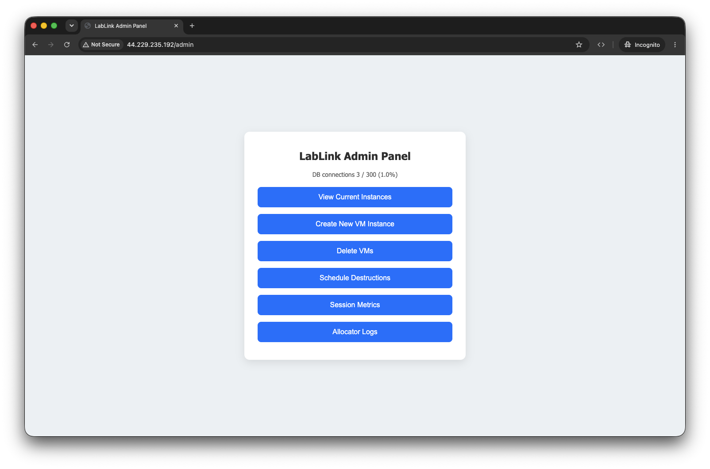

# LabLink

**Cloud-based virtual teaching lab accessible through Chrome browser.**

Run a hands-on workshop without the install day. LabLink gives every participant
their own cloud GPU desktop with your software already installed, reachable from a
Chrome tab — no local install, no GPU on their laptop, no per-machine debugging.

[](https://pypi.org/project/lablink-allocator-service/)
[](https://pypi.org/project/lablink-client-service/)
[](https://pypi.org/project/lablink-cli/)
[](https://github.com/talmolab/lablink/actions/workflows/ci.yml)
[](https://talmolab.github.io/lablink/)
[](LICENSE)

[](https://talmolab.github.io/lablink/workshop-guide/)

<sub>The admin dashboard: every participant VM, its health, and a one-click desktop link. See the [Workshop Guide](https://talmolab.github.io/lablink/workshop-guide/).</sub>

---

## 🧭 How It Works



You deploy one **allocator** into your own cloud account. It provisions **client VMs**
— one per participant — and hands each person a browser desktop when they claim a
seat. Full detail: [Architecture](https://talmolab.github.io/lablink/architecture/).

---

## 📦 What's in This Repository

This repository contains the **core LabLink packages, Docker images, and documentation**:

### Python Packages

Published to PyPI:

- **[lablink-allocator](packages/allocator/)** - VM Allocator Service

  ```bash
  pip install lablink-allocator-service
  ```

- **[lablink-client](packages/client/)** - Client Service

  ```bash
  pip install lablink-client-service
  ```

- **[lablink-cli](packages/cli/)** - Command-line tool to deploy and manage LabLink infrastructure

  ```bash
  uv tool install lablink-cli   # or: pip install lablink-cli
  ```

  The package is `lablink-cli`; the command it installs is `lablink`. To work on
  the CLI itself, install from source instead — see the
  [Contributing Guide](https://talmolab.github.io/lablink/contributing/).

### Docker Images (Published to GHCR)

Production images are built from the PyPI packages:

- **lablink-allocator-image** - Allocator service container

  ```bash
  docker pull ghcr.io/talmolab/lablink-allocator-image:latest
  ```

- **lablink-client-base-image** - Client service container
  ```bash
  docker pull ghcr.io/talmolab/lablink-client-base-image:latest
  ```

**Available Tags:**

- `latest` - Latest stable release
- `linux-amd64-latest` - Latest for specific platform
- `<sha>` - Specific git commit
- `linux-amd64-test` - Development/testing builds
- `<version>` (e.g., `0.3.0`) - Only published when a build is triggered manually

See [Docker Image Tags](https://talmolab.github.io/lablink/workflows/#image-tagging-strategy) for complete tagging strategy.

### Documentation

- **[LabLink Docs](https://talmolab.github.io/lablink/)** - Comprehensive documentation
  - Getting Started
  - Configuration
  - API Reference
  - Contributing Guide

---

## 🚀 Quick Start

### Two Deployment Paths

|           | **Path A — CLI (recommended)**        | **Path B — Template fork**                                            |
| --------- | ------------------------------------- | --------------------------------------------------------------------- |
| Install   | `uv tool install lablink-cli`         | Fork [lablink-template](https://github.com/talmolab/lablink-template) |
| Configure | Interactive TUI (`lablink configure`) | Edit `config/config.yaml` by hand                                     |
| Deploy    | `lablink deploy`                      | `terraform apply`                                                     |
| Best for  | Most users                            | Custom Terraform workflows                                            |

Either path ends at the same admin panel, where you create VMs before the session
and share one link with the room:

[](https://talmolab.github.io/lablink/workshop-guide/)

**What your participants see:** they open the link, enter their email, and land in a
full desktop with your software running — nothing to install.
[Watch the 30-second demo](https://talmolab.github.io/lablink/#see-it-in-action).

### Using the CLI


<sub>`lablink configure` walks the whole deployment: region, instance types, DNS &amp; SSL, then writes `~/.lablink/config.yaml`.</sub>

```bash
# Install from PyPI (see docs/cli/installation.md)
uv tool install lablink-cli

# Interactive configuration wizard (Textual TUI)
lablink configure

# Validate your environment
lablink doctor

# Deploy the allocator
lablink setup   # S3 bucket + DynamoDB lock table for Terraform state (run by `configure`)
lablink deploy  # provision the allocator

# Add clients
lablink client launch --num-vms 5   # AWS: allocator provisions client VMs
lablink client register             # manual provider: register a bring-your-own box

# Monitor
lablink status  # check running infrastructure
lablink logs    # live log viewer (Textual TUI)
```

### For Developers

**Contributing to LabLink packages:**

```bash
# Clone the repository
git clone https://github.com/talmolab/lablink.git
cd lablink

# Install uv (recommended Python package manager)
curl -LsSf https://astral.sh/uv/install.sh | sh

# Install all three packages into one shared venv at the repo root.
uv sync --all-packages --extra dev

# Run a package's tests (terraform tests need AWS credentials, so skip them locally)
cd packages/allocator && PYTHONPATH=src uv run pytest --ignore=tests/terraform
```

See the [Contributing Guide](https://talmolab.github.io/lablink/contributing/) for detailed development instructions.

---

## 📚 Documentation

- **[Full Documentation](https://talmolab.github.io/lablink/)** - Complete guide
- **[Architecture](https://talmolab.github.io/lablink/architecture/)** - System design
- **[Configuration](https://talmolab.github.io/lablink/configuration/)** - Configuration options
- **[API Reference](https://talmolab.github.io/lablink/reference/)** - Package APIs
- **[Contributing](https://talmolab.github.io/lablink/contributing/)** - Contribution guide

---

## 🏗️ Repository Structure

```
lablink/
├── packages/
│   ├── allocator/                           # Allocator Python package
│   │   ├── src/lablink_allocator_service/   # Source code
│   │   │   └── terraform/                   # Client VM Terraform (part of package)
│   │   ├── tests/                           # Unit tests including Terraform tests
│   │   ├── Dockerfile                       # Production image (from PyPI)
│   │   └── Dockerfile.dev                   # Development image (local code)
│   ├── client/                              # Client Python package
│   │   ├── src/lablink_client_service/      # Source code
│   │   ├── tests/                           # Unit tests
│   │   ├── Dockerfile                       # Production image (from PyPI)
│   │   └── Dockerfile.dev                   # Development image (local code)
│   └── cli/                                 # CLI Python package (Typer + Textual)
│       ├── src/lablink_cli/                 # Source code (commands, TUI, config)
│       └── tests/                           # Unit tests
├── docs/                                    # MkDocs documentation
└── .github/workflows/                       # CI/CD workflows
    ├── ci.yml                               # Tests, linting, Docker builds
    ├── publish-pip.yml                      # PyPI publishing
    ├── lablink-images.yml                   # Docker image builds & pushes
    └── docs.yml                             # Documentation deployment
```

**Note**: Infrastructure deployment code (allocator EC2, DNS, etc.) has been moved to [lablink-template](https://github.com/talmolab/lablink-template).

---

## 📦 Package Versioning

LabLink uses **independent versioning** for its packages:

- **lablink-allocator-service**: [](https://pypi.org/project/lablink-allocator-service/)
- **lablink-client-service**: [](https://pypi.org/project/lablink-client-service/)
- **lablink-cli**: [](https://pypi.org/project/lablink-cli/)

---

## 🤝 Contributing

We welcome contributions! Please see:

- **[Contributing Guide](https://talmolab.github.io/lablink/contributing/)** - How to contribute
- **[Developer Guide (CLAUDE.md)](CLAUDE.md)** - Developer-focused overview
- **[Code of Conduct](https://talmolab.github.io/lablink/contributing/#code-of-conduct)** - Community guidelines

---

## 🔗 Related Repositories

- **[LabLink Template](https://github.com/talmolab/lablink-template)** - Infrastructure deployment template using LabLink packages

---

## 📝 License

[BSD-2-Clause License](LICENSE)

---

## 🙏 Acknowledgments

LabLink is developed by the [Talmo Lab](https://github.com/talmolab) for the research community.

---

**Questions?** Check the [FAQ](https://talmolab.github.io/lablink/faq/) or open an [issue](https://github.com/talmolab/lablink/issues).
