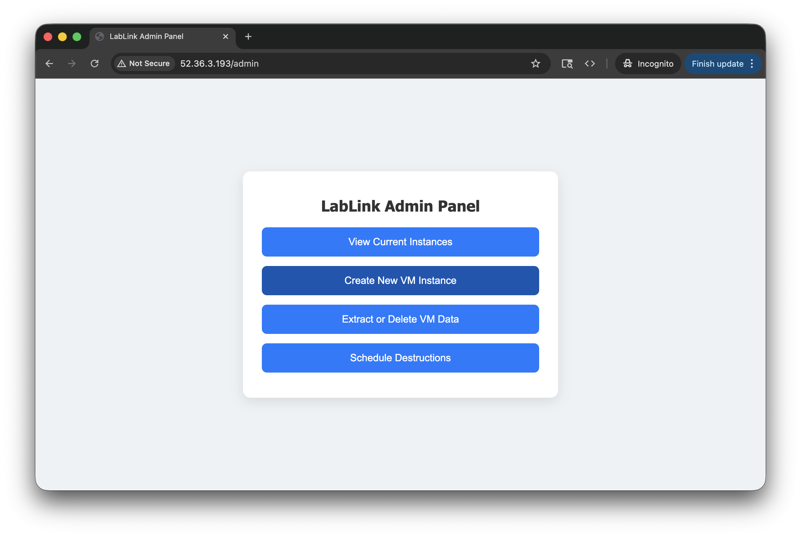
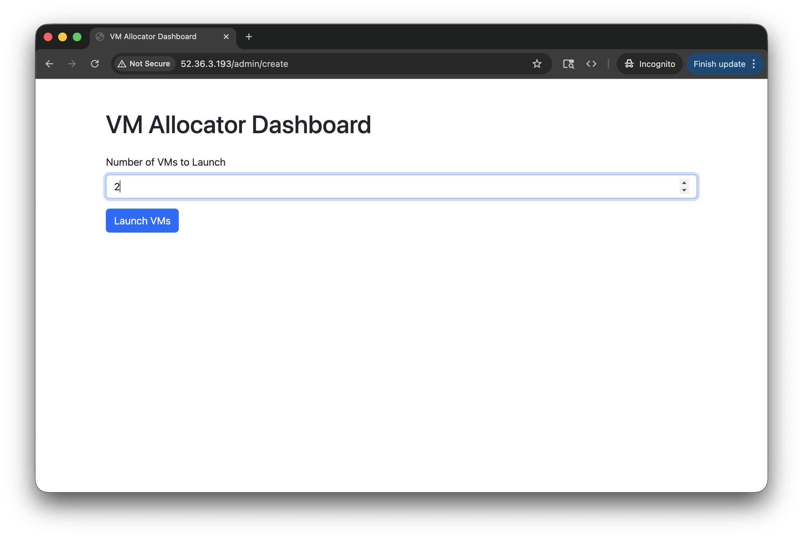
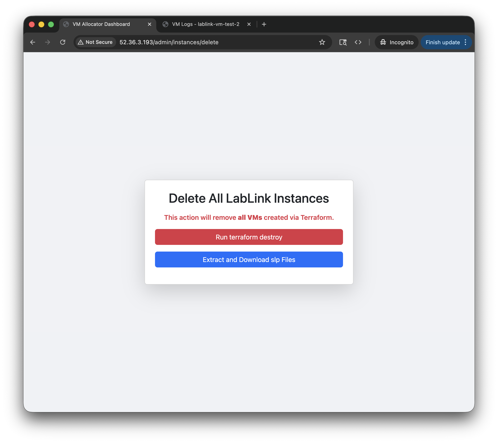
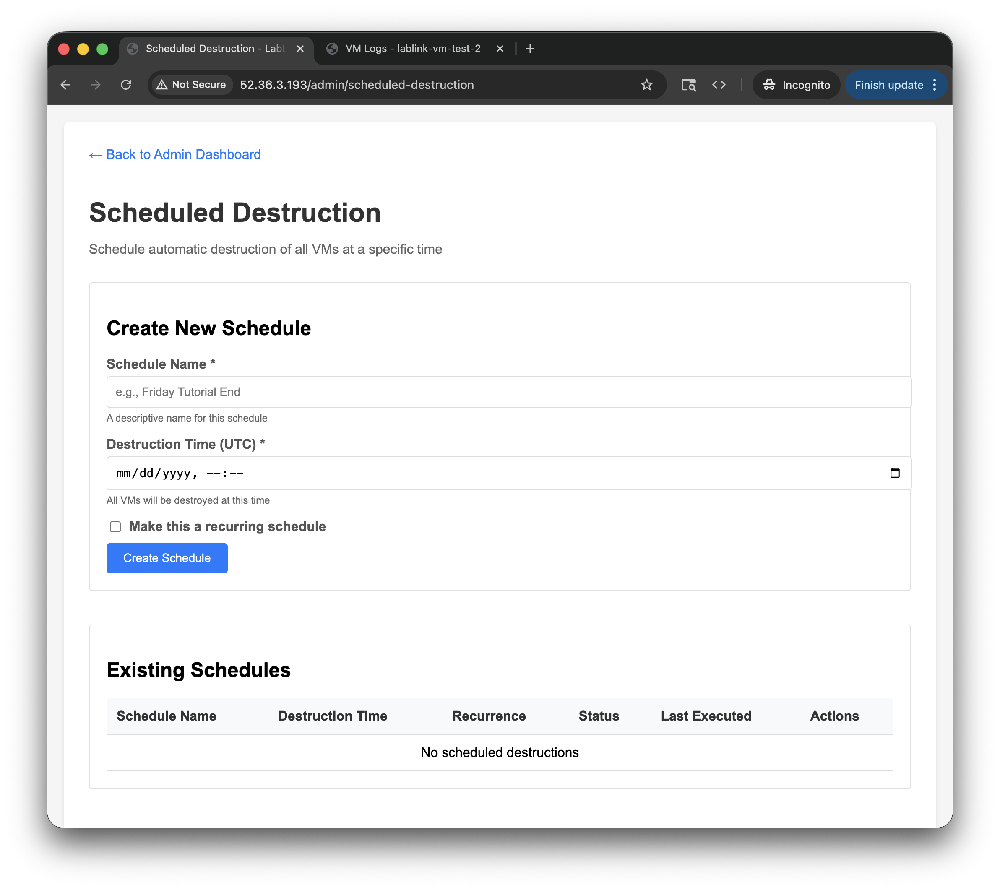

# Admin Panel

The admin panel provides a web interface for managing client VMs during a lab session. Access it at `http://<allocator-ip>/admin` using your admin credentials.




## VM Status Dashboard

The admin panel displays a table of all client VMs with the following information for each:


| Column | Description |
|--------|-------------|
| **Hostname** | VM instance identifier |
| **Health** | Overall VM health status (running, initializing, stopped) |
| **GPU Health** | GPU availability and CUDA status |
| **Logs** | Link to view startup and runtime logs for the VM |
| **Assigned CRD** | Chrome Remote Desktop connection link for the VM |
| **User Email** | Email of the participant assigned to the VM |

## Creating VMs

To add VMs as more participants join:

1. Navigate to the admin panel
2. Click **"Create VMs"**
3. Enter the number of VMs to launch
4. Click **"Launch VMs"**



VMs take approximately 5 minutes to provision and become available. The status dashboard updates automatically as VMs come online.

!!! tip
    You can create additional VMs at any time during a session without affecting existing running VMs.

## Destroying VMs

### Destroy All VMs

To tear down all VMs at the end of a session:

1. Navigate to the admin panel
2. Click **"Destroy All VMs"**
3. Confirm the action

This runs `terraform destroy` to terminate all client EC2 instances and clears VM records from the database.



!!! warning
    This is a destructive action that terminates all running VMs immediately. Make sure to extract any user data before destroying.

### Scheduled VM Destruction

You can schedule VMs to be automatically destroyed at a specific time. This is useful for ending lab sessions at a predetermined time without manual intervention.

1. Navigate to the admin panel
2. Set the desired destruction date and time
3. Confirm the schedule



The allocator will automatically destroy all VMs at the scheduled time.

## Extracting User Data

To download files created by participants during a session:

1. Navigate to the admin panel
2. Click **"Download User Data"**
3. The allocator connects to each running VM via SSH, collects files matching the configured extension (e.g., `.slp`), and packages them into a zip file for download


The file extension to collect is configured in your `config.yaml`:

```yaml
app:
  extension: ".slp"
```

!!! note
    The download may take a few minutes depending on the number of VMs and file sizes. Ensure VMs are still running when extracting data — files are not recoverable after VMs are destroyed.

## Related

- [API Endpoints](api-endpoints.md#admin-api-endpoints) for programmatic access to these features
- [Configuration](configuration.md) for admin password and app settings
- [Security](security.md) for authentication details
