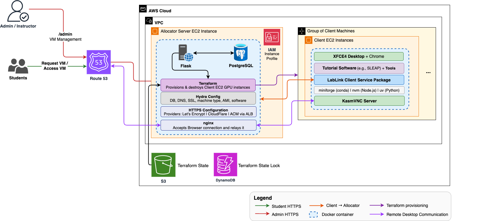
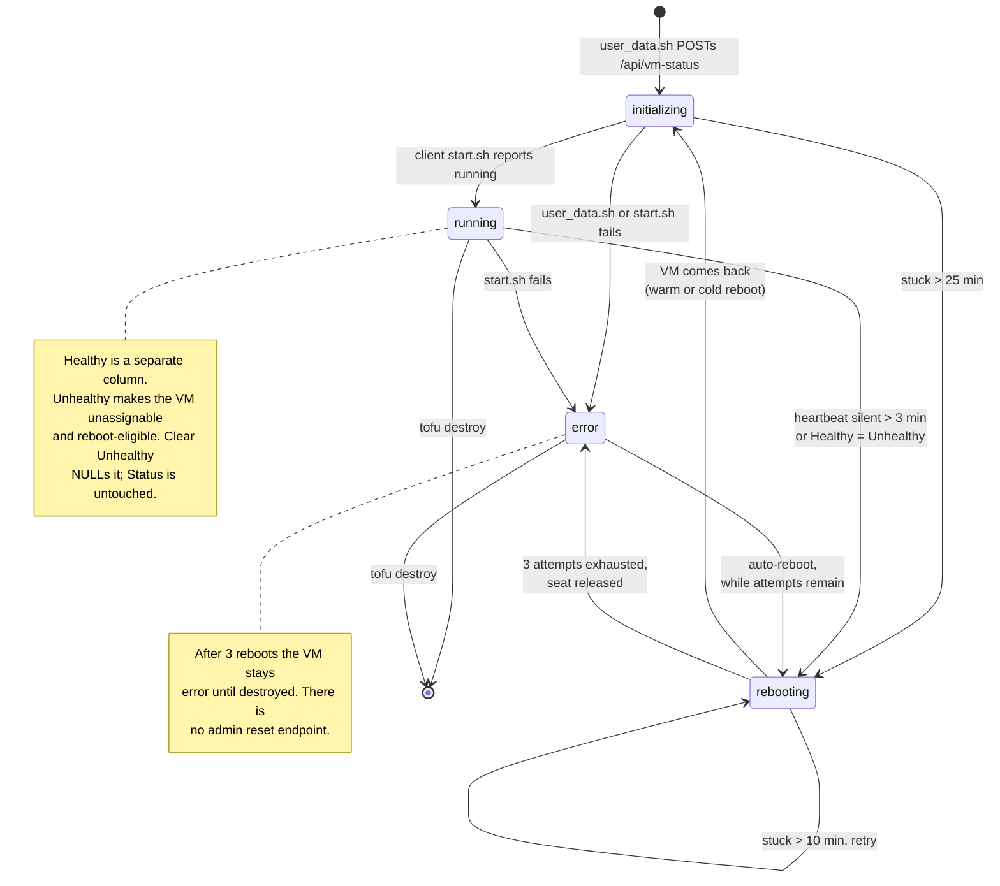
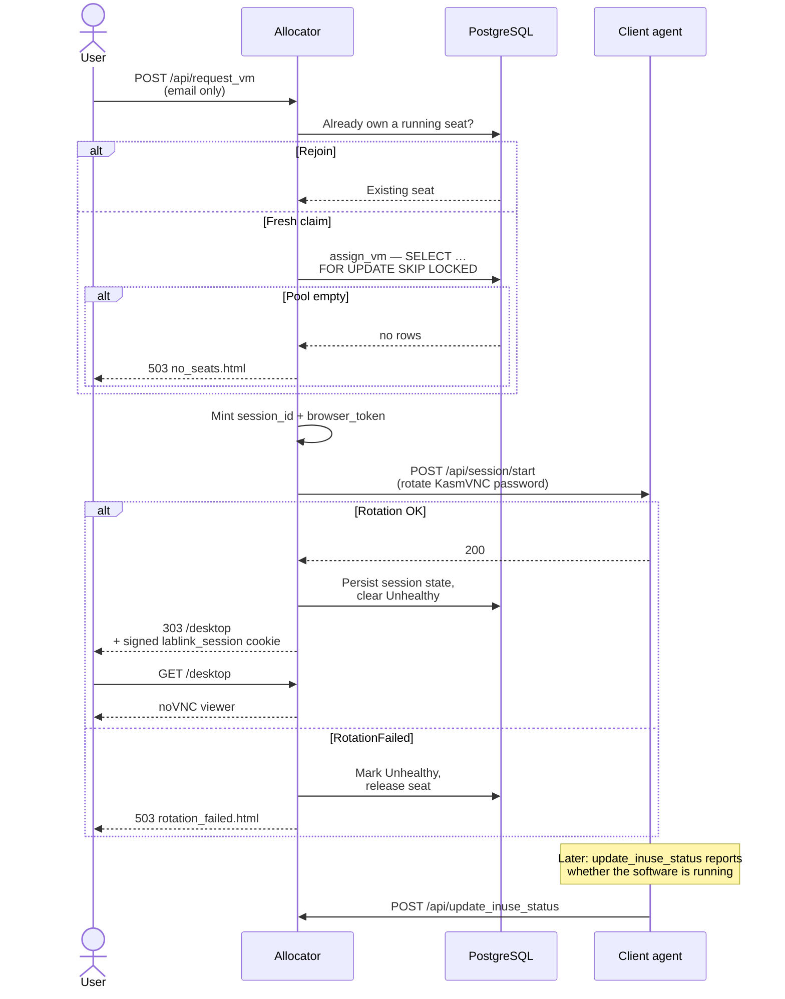
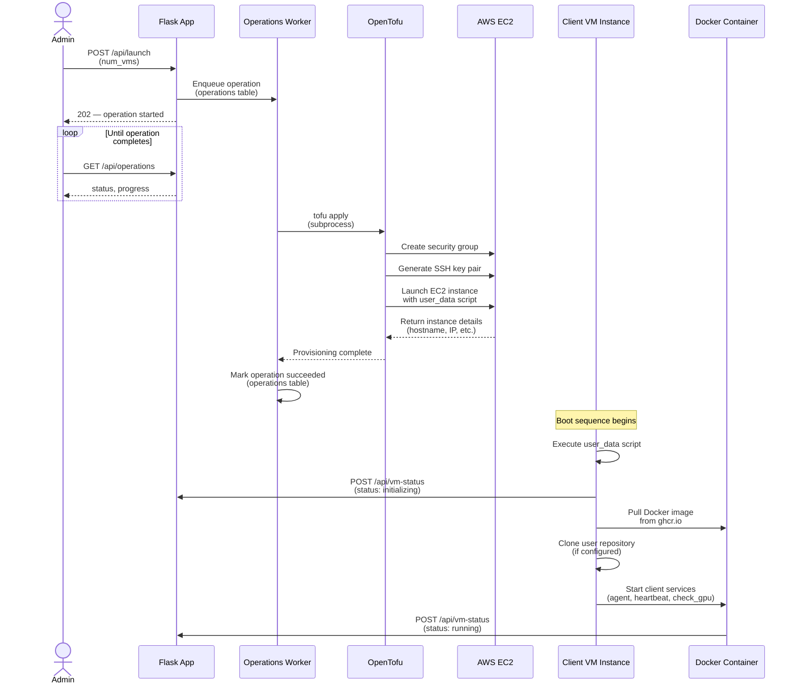
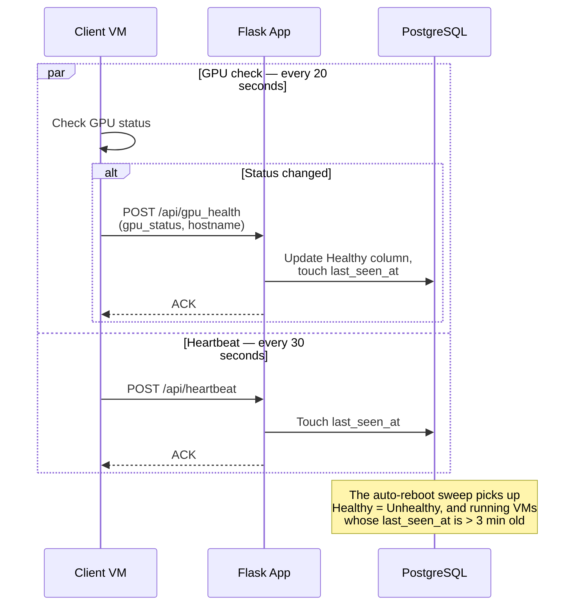

# Architecture

This page describes LabLink's architecture, components, and how they interact.

## System Overview

Two repositories feed a deployment. This repo (`talmolab/lablink`) publishes the
Python packages to PyPI and the Docker images to ghcr.io;
[`talmolab/lablink-template`](https://github.com/talmolab/lablink-template)
holds the allocator's OpenTofu configs, released as tagged bundles. The
`lablink` CLI downloads a pinned template release and runs OpenTofu itself —
alternatively, admins can fork the template repo and deploy through its GitHub
Actions workflows. See [LabLink CLI](cli/index.md) for how the paths compare,
[CLI First Deployment](cli/first-deployment.md) and
[Template Repo Deployment](deployment.md) for the steps.

A deployed LabLink on AWS. Admins and students reach the allocator by its
Elastic IP or, optionally, a Route 53 name; the allocator instance runs Flask,
PostgreSQL, the provisioner and nginx in one container, provisions client
instances, and relays each participant's remote-desktop connection to the
KasmVNC server on their assigned client.

Inside the allocator container, nginx on port 5000 is the only network-facing
process: Flask binds loopback (127.0.0.1:8000) and PostgreSQL runs co-located
in the same container. Participants' noVNC traffic is proxied by that nginx to
the client's KasmVNC WebSocket — the browser never talks to a client VM
directly, except under `manual.connectivity=lan_direct`, where it opens a
WebSocket straight to the client's LAN IP (see
[Client connectivity](#client-connectivity-how-the-desktop-is-reached)).
When `ssl.provider=letsencrypt` (the default) or `cloudflare`, a
Caddy reverse proxy on the EC2 host terminates TLS on ports 80/443 and
forwards to the container's port 5000.

Depending on configuration, extra processes join the stack: a `wstunnel`
server inside the container (`manual.connectivity=reverse_tunnel`), a
`cloudflared` connector inside the container
(`manual.participant_exposure=cloudflare_tunnel`), and a Tailscale sidecar
container (`manual.connectivity=mesh_overlay`).

## Providers and Connectivity

Two axes decide how a LabLink deployment is shaped. Both are resolved once at
startup, in `providers/registry.py`, and the rest of the codebase talks to the
resulting objects rather than branching on provider type.

### Compute provider — where client machines come from

Discovered through the `lablink.providers` entry-point group, so a new backend can be
added without touching core code. Two ship today, `aws` and `manual` — see
[Two providers](cli/index.md#two-providers) for the comparison.

Capability flags, not provider-type checks, gate the behaviour that differs:

- **`can_provision_hosts`** — false for `manual`, which is why that deployment surfaces its register token in the container logs for the CLI to pick up, rather than passing it through an OpenTofu output.
- **`can_recover_hosts`** — false for `manual`, so the auto-reboot loop skips BYO boxes instead of attempting AWS calls against machines it doesn't own.

### Client connectivity — how the desktop is reached

Selectable for the `manual` provider only, as a small closed set —
`lan_direct`, `mesh_overlay`, `reverse_tunnel`. The byte path of each and how
to choose are in
[Pick a connectivity mode](cli/byo-clients.md#pick-a-connectivity-mode).

Each strategy implements `prepare_browser_session`, which is what
`/api/request_vm` calls to rotate the client's VNC password and persist the
`browser_ws_url` the viewer page will open — which is why the assignment path has no
connectivity-specific branches in it.

AWS deployments always use the allocator-proxied path and ignore this setting.

See [Configuration](configuration.md#manual-provider-options-manual) for the
settings and [API Endpoints](api-endpoints.md#client-registration-api) for the
registration contract.

## Component Details

### Allocator Service

**Purpose**: Central management server for VM allocation and orchestration.

**Technology Stack**:

- **Flask**: Web application framework, behind nginx (the container's only network-facing process); Caddy on the host adds automatic HTTPS
- **PostgreSQL 17**: Relational database for VM state, co-located in the container; `SKIP LOCKED` gives race-free seat claims
- **psycopg2**: Direct SQL through a shared connection pool (see `db/` layout in `CLAUDE.md`); no ORM — SQLAlchemy appears in the dependencies only as APScheduler's job store
- **APScheduler**: Scheduled destruction jobs
- **Hydra/OmegaConf**: Structured config with typed overrides
- **OpenTofu**: Infrastructure provisioning
- **Docker**: Containerization

**Key Responsibilities**:

1. **Web Interface**:

    - Admin dashboard for VM management
    - VM creation interface
    - Instance listing and monitoring

2. **API Endpoints**:

    - `/api/request_vm`: Claim a seat for a participant
    - `/desktop`: Cookie-gated noVNC viewer
    - `/api/launch`: Provision new VM instances (async operation)
    - `/admin/instances`: List all instances
    - `/admin/allocator-logs`: The allocator's own log viewer
    - `/api/v1/clients/register`: BYO client self-registration
    - `/api/heartbeat`: Client liveness reporting

    See [API Endpoints](api-endpoints.md) for the full surface.

3. **Database Management**:

    - Tracks VM states (`initializing`, `running`, `error`, `rebooting`; `unknown` is accepted by the status endpoint but nothing writes it)
    - Claims seats atomically with `FOR UPDATE SKIP LOCKED`

4. **Infrastructure Orchestration**:
    - Spawns and destroys client VMs via OpenTofu, as **async operations**: `/api/launch` and `/destroy` enqueue a job in the `operations` table, a background worker runs `tofu apply`/`destroy`, and the admin dashboard polls `/api/operations` for progress. Only one operation runs at a time — enforced by the `operations_single_flight` partial unique index, not by application locking
    - Manages AWS credentials
    - Handles security group configuration

5. **Auto-Reboot Service**:
    - Background thread, 60 s sweep, that picks up VMs with `status=error`, `Healthy=Unhealthy`, `initializing` for >25 min, `rebooting` for >10 min, or `running` with no heartbeat for >3 min
    - Assigned VMs get a **warm** `sudo reboot` (the container survives via its restart policy); unassigned VMs get a **cold** `docker rm -f; cloud-init clean && reboot` that re-provisions from scratch
    - EC2 stop/start only when SSH fails (always cold)
    - 300 s cooldown between attempts; after 3 attempts the VM is set to `error` and its seat released

**Configuration**: See `packages/allocator/src/lablink_allocator_service/conf/structured_config.py`

### Client Service

**Purpose**: Runs on dynamically created VMs to execute research workloads.

**Technology Stack**:

- **Python**: Service implementation
- **KasmVNC + noVNC**: Browser-only remote desktop, no client install
- **Docker**: Container runtime
- **Custom Software**: SLEAP or user-defined

**Key Responsibilities**:

1. **Health Monitoring**:

    - GPU health checks (every 20 seconds)
    - System resource monitoring
    - Reports status to allocator

2. **Allocator Communication**:

    - Authenticated with its own per-client secret, issued at registration
    - Heartbeat mechanism
    - Status updates (in-use, health, startup timings)
    - Failure reporting

3. **Desktop Session**:
    - Runs a KasmVNC desktop the participant reaches in a browser
    - Exposes a local agent the allocator calls to rotate the VNC password per session
    - Clones the configured repository and runs the containerized research software

**Desktop performance**: the client deliberately overrides seven upstream
defaults, because stock KasmVNC and XFCE never reduce cost while the screen is
moving. Do not revert these to their defaults without re-measuring:

| Override | Default | Why |
|---|---|---|
| `xfwm4` `use_compositing: false` | on | The compositor recomposites the whole screen on every window move, so Xvnc sees one full-screen damage rect instead of a few small ones. |
| `-DynamicQualityMin 4` | 7 | The stock 7–8 band is pinned near maximum. KasmVNC varies quality within the band by how fast the screen is *changing*, not by network feedback, so the floor is what governs motion smoothness. |
| `-VideoTime 2` | 5 | Sustained motion otherwise spends five seconds in per-rect JPEG/WebP before video mode engages. |
| `-DetectScrolling 1` | off | Sends a cheap region shift instead of re-encoding the scrolled region. |
| `-videoCodec auto` | `""` (empty) | KasmVNC 1.5.0 gates all video streaming on this being non-empty — with the default the server never advertises H.264 and every session silently stays in per-rect JPEG/WebP. `auto` picks the best probed encoder (NVENC → VAAPI → software x264). |
| `Xft` `RGBA: none` | `rgb` (subpixel) | Subpixel antialiasing puts coloured fringes on every glyph, and at `-DynamicQualityMin 4` those fringes are the first thing the encoder discards — text ends up ringed with colour noise. Greyscale antialiasing compresses better and stays legible at the quality floor. |
| Solid backdrop (`image-style: 0`) | wallpaper image | The exposed desktop is re-encoded during every window drag. A flat fill costs almost nothing per damage rect where a photograph costs a lot — and it saves the 57 MB `ubuntu-wallpapers` package. |

Encoder flags go on the `Xvnc` command line; `~/.vnc/kasmvnc.yaml` is still
written but inert, because `start.sh` bypasses the `kasmvncserver` wrapper
that reads it. The full rationale — the viewer-preset caveat, the EGL vendor
pinning, the trimmed XFCE package set — lives as comments in
`packages/client/start.sh` and `packages/client/desktop-config.sh`.

**Configuration**: See `packages/client/src/lablink_client_service/conf/structured_config.py`

### Database Schema

Four tables: `vms` (one row per client machine), `operations` (async provisioning
work), `scheduled_destructions`, and `settings` (deployment-wide key/value state).

The `vms` row carries the machine's identity and assignment, its provider and
connectivity details, per-session browser state, liveness counters, startup timings,
and — when enabled — session metrics. Full column-by-column reference:
[Database](database.md#vms-table).

**Triggers**: one, maintaining `updated_at` on `scheduled_destructions`. Seat
assignment uses `FOR UPDATE SKIP LOCKED`; see [Database](database.md#triggers).

### VM State Machine

The `Status` column in the `vms` table follows this lifecycle:

```mermaid
stateDiagram-v2
    [*] --> initializing: user_data.sh POSTs /api/vm-status
    initializing --> running: client start.sh reports running
    initializing --> error: user_data.sh or start.sh fails
    running --> error: start.sh fails
    initializing --> rebooting: stuck > 25 min
    running --> rebooting: heartbeat silent > 3 min<br/>or Healthy = Unhealthy
    error --> rebooting: auto-reboot,<br/>while attempts remain
    rebooting --> initializing: VM comes back<br/>(warm or cold reboot)
    rebooting --> rebooting: stuck > 10 min, retry
    rebooting --> error: 3 attempts exhausted,<br/>seat released
    running --> [*]: tofu destroy
    error --> [*]: tofu destroy

    note right of running
        Healthy is a separate column.
        Unhealthy makes the VM unassignable
        and reboot-eligible. Clear Unhealthy
        NULLs it; Status is untouched.
    end note

    note right of error
        After 3 reboots the VM stays
        error until destroyed. There is
        no admin reset endpoint.
    end note
```

| `Status` | Written by | Meaning |
|---|---|---|
| `initializing` | `user_data.sh` on boot; client `start.sh` on container start (so also after a warm reboot) | Booting or starting the client container |
| `running` | client `start.sh`, once services are about to launch | Claimable when `UserEmail` and `AdminReservedAt` are `NULL` and `Healthy` is not `Unhealthy` |
| `error` | `user_data.sh` / `start.sh` failure paths; the auto-reboot service when attempts are exhausted | Out of the pool |
| `rebooting` | the auto-reboot service | Attempt in flight; `reboot_count` incremented |
| `unknown` | nothing | Accepted by `/api/vm-status`, never written |

Two columns that are **not** status: `UserEmail` (assignment) and `InUse`
(whether the configured software is running, maintained by the client's
`update_inuse_status`). A participant can hold a seat with `InUse = FALSE`.

### AWS Infrastructure

#### Security Groups

**Allocator Security Group**:

- Ports 80/443 (HTTP/HTTPS): Caddy, when an SSL provider is configured
- Port 5000: The container's nginx (direct access for `ssl.provider=none`, or from the ALB in the ACM setup)
- Port 22 (SSH): Administrative access

PostgreSQL is not exposed: clients report over the HTTP API, not by connecting
to the database.

**Client Security Group**:

- Port 22 (SSH): Administrative access
- Port 6080 (KasmVNC WebSocket) and port 7070 (client agent): Reachable from the allocator, which proxies participant traffic
- Egress: Full internet access for package downloads

#### Networking

- **Elastic IPs**: Static IPs for allocators (one per environment)
- **VPC**: Default VPC or custom (configurable)
- **Route 53** (Optional): DNS management for friendly URLs

#### Storage

- **S3 Buckets**: OpenTofu state storage

    - Separate state per named deployment (CLI) or per environment (template repo)
    - DynamoDB lock table prevents concurrent applies
    - Versioning enabled

- **EBS Volumes**: Instance root volumes
    - Allocator (`t3.large`): the template sets no `root_block_device`, so the AMI default applies (8 GiB gp3 for stock Ubuntu)
    - Clients: 80 GiB

## Data Flow

### Seat Assignment Flow

```mermaid
sequenceDiagram
    actor User
    participant Flask as Allocator
    participant DB as PostgreSQL
    participant Agent as Client agent

    User->>Flask: POST /api/request_vm<br/>(email only)
    Flask->>DB: Already own a running seat?

    alt Rejoin
        DB-->>Flask: Existing seat
    else Fresh claim
        Flask->>DB: assign_vm — SELECT … <br/>FOR UPDATE SKIP LOCKED
        alt Pool empty
            DB-->>Flask: no rows
            Flask-->>User: 503 no_seats.html
        end
    end

    Flask->>Flask: Mint session_id + browser_token
    Flask->>Agent: POST /api/session/start<br/>(rotate KasmVNC password)

    alt Rotation OK
        Agent-->>Flask: 200
        Flask->>DB: Persist session state,<br/>clear Unhealthy
        Flask-->>User: 303 /desktop<br/>+ signed lablink_session cookie
        User->>Flask: GET /desktop
        Flask-->>User: noVNC viewer
    else RotationFailed
        Flask->>DB: Mark Unhealthy,<br/>release seat
        Flask-->>User: 503 rotation_failed.html
    end

    Note over Agent: Later: update_inuse_status reports<br/>whether the software is running
    Agent->>Flask: POST /api/update_inuse_status
```

### VM Creation Flow

```mermaid
sequenceDiagram
    actor Admin
    participant Flask as Flask App
    participant Worker as Operations Worker
    participant OpenTofu
    participant AWS as AWS EC2
    participant VM as Client VM Instance
    participant Docker as Docker Container

    Admin->>Flask: POST /api/launch<br/>(num_vms)
    Flask->>Worker: Enqueue operation<br/>(operations table)
    Flask-->>Admin: 202 — operation started

    loop Until operation completes
        Admin->>Flask: GET /api/operations
        Flask-->>Admin: status, progress
    end

    Worker->>OpenTofu: tofu apply<br/>(subprocess)
    OpenTofu->>AWS: Create security group
    OpenTofu->>AWS: Generate SSH key pair
    OpenTofu->>AWS: Launch EC2 instance<br/>with user_data script
    AWS-->>OpenTofu: Return instance details<br/>(hostname, IP, etc.)
    OpenTofu-->>Worker: Provisioning complete
    Worker->>Worker: Mark operation succeeded<br/>(operations table)

    Note over VM: Boot sequence begins
    VM->>VM: Execute user_data script
    VM->>Flask: POST /api/vm-status<br/>(status: initializing)

    VM->>Docker: Pull Docker image<br/>from ghcr.io
    VM->>VM: Clone user repository<br/>(if configured)
    VM->>Docker: Start client services<br/>(agent, heartbeat, check_gpu)
    Docker->>Flask: POST /api/vm-status<br/>(status: running)
```

A second `/api/launch` or `/destroy` while one is in progress is rejected with
the in-flight job's id — the `operations_single_flight` index makes the second
`INSERT` fail.

### Health Check Flow

```mermaid
sequenceDiagram
    participant Client as Client VM
    participant Flask as Flask App
    participant DB as PostgreSQL

    par GPU check — every 20 seconds
        Client->>Client: Check GPU status
        alt Status changed
            Client->>Flask: POST /api/gpu_health<br/>(gpu_status, hostname)
            Flask->>DB: Update Healthy column,<br/>touch last_seen_at
            Flask-->>Client: ACK
        end
    and Heartbeat — every 30 seconds
        Client->>Flask: POST /api/heartbeat
        Flask->>DB: Touch last_seen_at
        Flask-->>Client: ACK
    end

    Note over DB: The auto-reboot sweep picks up<br/>Healthy = Unhealthy, and running VMs<br/>whose last_seen_at is > 3 min old
```

Both endpoints authenticate with the per-client secret issued at
registration. GPU health lands in the `Healthy` column (`Healthy`,
`Unhealthy`, `N/A`) rather than flipping `Status` directly — the auto-reboot
service decides what to do about an unhealthy VM. A stale heartbeat is not a
state of its own; it simply makes the VM reboot-eligible.

## CI/CD Pipeline

See [Workflows](workflows.md) for detailed CI/CD architecture.

**Key Workflows** (this repo):

1. **CI** (`ci.yml`): Lints and tests all three packages on pull requests

2. **Build Images** (`lablink-images.yml`):

    - Triggers on PRs, pushes to `main`/`test`, and manual dispatch
    - Builds allocator and client Docker images
    - Pushes to GitHub Container Registry

3. **Publish Packages** (`publish-pip.yml`): Publishes the allocator, client,
   and CLI packages to PyPI on releases/tags

Infrastructure deployment workflows live in the
[template repository](https://github.com/talmolab/lablink-template), not here.

## Security Architecture

- **TLS**: Caddy on the allocator host terminates HTTPS (Let's Encrypt by default); inside the container, nginx is the only network-facing process
- **Admin Authentication**: HTTP Basic Auth for admin dashboard and management endpoints
- **Client Registration & Secrets**: Clients (AWS-provisioned and BYO alike) register with a deployment-wide register token, and each is issued its own per-client secret — stored hashed, and presented as a Bearer token on every machine-to-machine endpoint
- **Participant Sessions**: `/api/request_vm` sets a signed `lablink_session` cookie; nginx gates the noVNC WebSocket proxy through Flask via `auth_request` (`/internal/proxy_auth`)
- **OIDC Authentication**: GitHub Actions authenticate to AWS without stored credentials
- **SSH Keys**: Auto-generated per environment, ephemeral artifacts
- **Network**: Security groups restrict access by port and source; client desktops are reachable only through the allocator's proxy

See [Security](security.md) for detailed security considerations.
