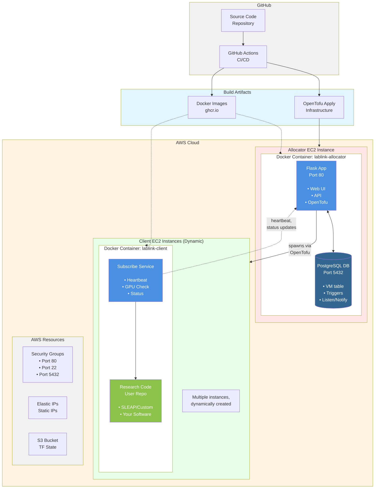
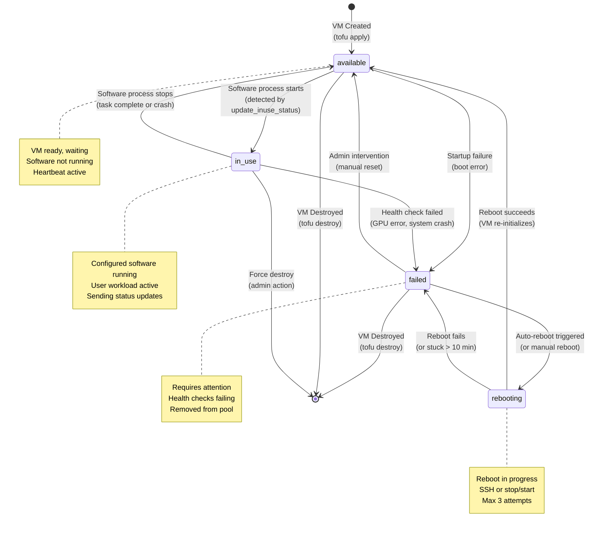
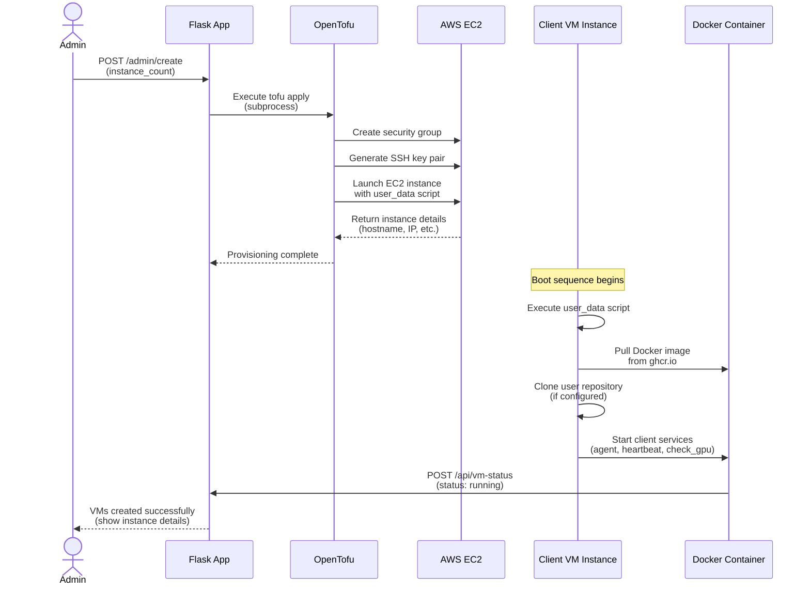
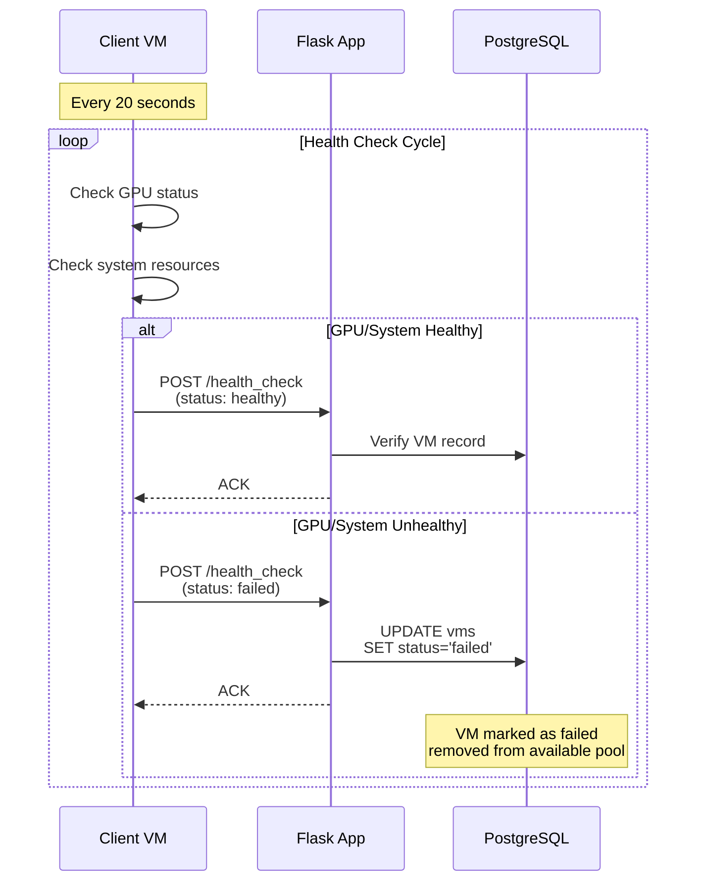

# Architecture

This page describes LabLink's architecture, components, and how they interact.

## System Overview

```mermaid
graph TB
    subgraph GitHub["GitHub"]
        SourceCode[Source Code<br/>Repository]
        Actions[GitHub Actions<br/>CI/CD]
        SourceCode --> Actions
    end

    subgraph Artifacts["Build Artifacts"]
        DockerImages[Docker Images<br/>ghcr.io]
        TofuDeploy[OpenTofu Apply<br/>Infrastructure]
    end

    Actions --> DockerImages
    Actions --> TofuDeploy

    subgraph AWS["AWS Cloud"]
        subgraph AllocatorInstance["Allocator EC2 Instance"]
            subgraph AllocatorContainer["Docker Container: lablink-allocator"]
                Flask[Flask App<br/>Port 80<br/><br/>• Web UI<br/>• API<br/>• OpenTofu]
                PostgreSQL[(PostgreSQL DB<br/>Port 5432<br/><br/>• VM table<br/>• Triggers<br/>• Listen/Notify)]
                Flask <--> PostgreSQL
            end
        end

        subgraph ClientInstances["Client EC2 Instances (Dynamic)"]
            subgraph ClientContainer["Docker Container: lablink-client"]
                Subscribe[Subscribe Service<br/><br/>• Heartbeat<br/>• GPU Check<br/>• Status]
                Research[Research Code<br/>User Repo<br/><br/>• SLEAP/Custom<br/>• Your Software]
                Subscribe --> Research
            end
            Note[Multiple instances,<br/>dynamically created]
        end

        subgraph AWSResources["AWS Resources"]
            SecurityGroups[Security Groups<br/>• Port 80<br/>• Port 22<br/>• Port 5432]
            ElasticIPs[Elastic IPs<br/>Static IPs]
            S3[S3 Bucket<br/>TF State]
        end
    end

    TofuDeploy --> AllocatorInstance
    DockerImages -.-> AllocatorContainer
    DockerImages -.-> ClientContainer
    Flask -->|spawns via<br/>OpenTofu| ClientInstances
    Subscribe -.->|heartbeat,<br/>status updates| Flask

    style GitHub fill:#f0f0f0
    style Artifacts fill:#e1f5ff
    style AWS fill:#fff4e1
    style AllocatorInstance fill:#ffe6e6
    style AllocatorContainer fill:#fff
    style ClientInstances fill:#e6ffe6
    style ClientContainer fill:#fff
    style AWSResources fill:#f0f0f0
    style Flask fill:#4a90e2,color:#fff
    style PostgreSQL fill:#336791,color:#fff
    style Subscribe fill:#4a90e2,color:#fff
    style Research fill:#8bc34a,color:#fff
```

## Providers and Connectivity

Two axes decide how a LabLink deployment is shaped. Both are resolved once at
startup, in `providers/registry.py`, and the rest of the codebase talks to the
resulting objects rather than branching on provider type.

### Compute provider — where client machines come from

Discovered through the `lablink.providers` entry-point group, so a new backend can be
added without touching core code. Two ship today:

| `provider` | Behaviour |
|---|---|
| `aws` | Provisions EC2 client VMs with OpenTofu. |
| `manual` | Provisions nothing. Machines you already own register themselves via `POST /api/v1/clients/register`. |

Capability flags, not provider-type checks, gate the behaviour that differs:

- **`can_provision_hosts`** — false for `manual`, which is why that deployment surfaces its register token in the container logs for the CLI to pick up, rather than passing it through a OpenTofu output.
- **`can_recover_hosts`** — false for `manual`, so the auto-reboot loop skips BYO boxes instead of attempting AWS calls against machines it doesn't own.

### Client connectivity — how the desktop is reached

Selectable for the `manual` provider only, as a small closed set:

| `manual.connectivity` | Byte path |
|---|---|
| `lan_direct` | The browser opens a WebSocket straight to the client's LAN IP. Requires the client and participant on the allocator's LAN. |
| `mesh_overlay` | The client joins a Tailscale tailnet; the allocator reaches it over the overlay and proxies through its own nginx. |
| `reverse_tunnel` | The client dials **out** to the allocator and holds one connection open, for boxes that can't accept inbound connections. |

Each strategy implements `prepare_browser_session`, which is what
`/api/request_vm` calls to rotate the client's VNC password and persist the
`browser_ws_url` the viewer page will open — which is why the assignment path has no
connectivity-specific branches in it.

AWS deployments always use the allocator-proxied path and ignore this setting.

See [Bring-Your-Own Clients](cli/byo-clients.md#pick-a-connectivity-mode) for
choosing between these,
[Configuration](configuration.md#manual-provider-options-manual) for the settings,
and [API Endpoints](api-endpoints.md#client-registration-api) for the registration
contract.

## Component Details

### Allocator Service

**Purpose**: Central management server for VM allocation and orchestration.

**Technology Stack**:

- **Flask**: Web application framework
- **PostgreSQL**: Relational database for VM state
- **SQLAlchemy**: ORM for database operations
- **OpenTofu**: Infrastructure provisioning
- **Docker**: Containerization

**Key Responsibilities**:

1. **Web Interface**:

   - Admin dashboard for VM management
   - VM creation interface
   - Instance listing and monitoring

2. **API Endpoints**:

   - `/api/request_vm`: Claim a seat for a participant
   - `/desktop`: Cookie-gated noVNC viewer
   - `/admin/create`: Create new VM instances
   - `/admin/instances`: List all instances
   - `/api/v1/clients/register`: BYO client self-registration
   - `/api/heartbeat`: Client liveness reporting

   See [API Endpoints](api-endpoints.md) for the full surface.

3. **Database Management**:

   - Tracks VM states (`initializing`, `running`, `error`, `rebooting`)
   - Claims seats atomically with `FOR UPDATE SKIP LOCKED`

4. **Infrastructure Orchestration**:
   - Spawns client VMs via OpenTofu
   - Manages AWS credentials
   - Handles security group configuration

5. **Auto-Reboot Service**:
   - Background daemon that monitors for failed VMs
   - Automatically reboots VMs in error state, with unhealthy GPUs, or stuck initializing/rebooting
   - Primary method: SSH hard reboot (`cloud-init clean && reboot`)
   - Fallback: EC2 stop/start cycle (for OOM or hung processes)
   - Respects cooldown periods (default: 300s) and max attempt limits (default: 3)

**Configuration**: See `packages/allocator/src/lablink_allocator/conf/structured_config.py`

### Client Service

**Purpose**: Runs on dynamically created VMs to execute research workloads.

**Technology Stack**:

- **Python**: Service implementation
- **Docker**: Container runtime
- **Custom Software**: SLEAP or user-defined

**Key Responsibilities**:

1. **Health Monitoring**:

   - GPU health checks (every 20 seconds)
   - System resource monitoring
   - Reports status to allocator

2. **Allocator Communication**:

   - Authenticated with its own per-client secret, issued at registration
   - Heartbeat mechanism
   - Status updates (in-use, health, startup timings)
   - Failure reporting

3. **Desktop Session**:
   - Runs a KasmVNC desktop the participant reaches in a browser
   - Exposes a local agent the allocator calls to rotate the VNC password per session
   - Clones the configured repository and runs the containerized research software

**Desktop performance**: the client deliberately overrides six upstream
defaults, because stock KasmVNC and XFCE never reduce cost while the screen is
moving — they hold near-maximum quality through a full-screen redraw and fall
behind, which participants perceive as choppy motion. Do not revert these to
their defaults without re-measuring:

| Override | Default | Why |
|---|---|---|
| `xfwm4` `use_compositing: false` | on | The compositor recomposites the whole screen on every window move, so Xvnc sees one full-screen damage rect instead of a few small ones. |
| `-DynamicQualityMin 4` | 7 | The stock 7–8 band is pinned near maximum. KasmVNC varies quality within the band by how fast the screen is *changing*, not by network feedback, so the floor is what governs motion smoothness. |
| `-VideoTime 2` | 5 | Sustained motion otherwise spends five seconds in per-rect JPEG/WebP before video mode engages. |
| `-DetectScrolling 1` | off | Sends a cheap region shift instead of re-encoding the scrolled region. |
| `Xft` `RGBA: none` | `rgb` (subpixel) | Subpixel antialiasing puts coloured fringes on every glyph, and at `-DynamicQualityMin 4` those fringes are the first thing the encoder discards — text ends up ringed with colour noise. Greyscale antialiasing compresses better and stays legible at the quality floor. |
| Solid backdrop (`image-style: 0`) | wallpaper image | The exposed desktop is re-encoded during every window drag. A flat fill costs almost nothing per damage rect where a photograph costs a lot — and it saves the 57 MB `ubuntu-wallpapers` package. |

The three encoder settings are passed on the `Xvnc` command line, not written
to `~/.vnc/kasmvnc.yaml`. That file is read only by the `kasmvncserver` Perl
wrapper, which `start.sh` bypasses to exec `Xvnc` directly, so tuning placed
there is silently ignored.

Every desktop setting is generated by `packages/client/desktop-config.sh`,
which `start.sh` runs before launching the session; that script's header is the
one place explaining why it writes the xfconf XML store directly and why it is
standalone. Turning the compositor off costs window drop shadows and ARGB
transparency — `xfce4-terminal`'s transparent background, for instance, renders
opaque. That is the trade, not a bug.

The desktop is XFCE 4.18 on Ubuntu 24.04, themed with Yaru, Ubuntu's own theme.
Yaru ships xfwm4 window decorations alongside the GTK theme and icons, so
window borders match rather than falling back to XFCE's default. The package
set names `xfce4-whiskermenu-plugin` and `xfce4-notifyd` directly instead of
pulling `xfce4-goodies`, which cost 92 MB and 82 packages for the two of them.
Accessories that came with that metapackage — mousepad, ristretto, xfburn,
xfce4-dict, the clipboard-history plugin, and around 20 panel plugins — are
deliberately absent.

`Xvnc` is launched with `__EGL_VENDOR_LIBRARY_FILENAMES` pinned to mesa and
`__EGL_EXTERNAL_PLATFORM_CONFIG_DIRS` pointed at an empty directory. Do not
remove these. The container toolkit bind-mounts the *host* driver's
`libEGL_nvidia.so.0` and `libnvidia-egl-gbm.so.1` into the container, along
with `10_nvidia.json` and `15_nvidia_gbm.json`, and libEGL loads them during
`GlxExtensionInit`. Those libraries are the host driver's while `libdrm.so.2`
is the image's, and on 24.04 that skew aborts Xvnc with a double free in
`drmFreeDevices` — the desktop never starts. The bind mounts cannot be moved
aside from inside the container, so the loader is pointed away from them
instead. The variables are set on the `Xvnc` process only: `xstartup`, the
desktop session, and SLEAP all keep the full driver stack and CUDA.

**Configuration**: See `packages/client/src/lablink_client/conf/structured_config.py`

### Database Schema

Four tables: `vms` (one row per client machine), `operations` (async provisioning
work), `scheduled_destructions`, and `settings` (deployment-wide key/value state).

The `vms` row carries the machine's identity and assignment, its provider and
connectivity details, per-session browser state, liveness counters, startup timings,
and — when enabled — session metrics. Full column-by-column reference:
[Database](database.md#vms-table).

**Triggers**: one, maintaining `updated_at` on `scheduled_destructions`. LabLink no
longer uses `LISTEN`/`NOTIFY`; see
[Database](database.md#triggers) for what replaced it.

### VM State Machine

The `status` field in the `vms` table follows this lifecycle:

```mermaid
stateDiagram-v2
    [*] --> available: VM Created<br/>(tofu apply)

    available --> in_use: Software process starts<br/>(detected by update_inuse_status)
    in_use --> available: Software process stops<br/>(task complete or crash)

    available --> failed: Startup failure<br/>(boot error)
    in_use --> failed: Health check failed<br/>(GPU error, system crash)

    failed --> rebooting: Auto-reboot triggered<br/>(or manual reboot)
    rebooting --> available: Reboot succeeds<br/>(VM re-initializes)
    rebooting --> failed: Reboot fails<br/>(or stuck > 10 min)

    failed --> available: Admin intervention<br/>(manual reset)
    failed --> [*]: VM Destroyed<br/>(tofu destroy)
    available --> [*]: VM Destroyed<br/>(tofu destroy)
    in_use --> [*]: Force destroy<br/>(admin action)

    note right of available
        VM ready, waiting
        Software not running
        Heartbeat active
    end note

    note right of in_use
        Configured software running
        User workload active
        Sending status updates
    end note

    note right of failed
        Requires attention
        Health checks failing
        Removed from pool
    end note

    note right of rebooting
        Reboot in progress
        SSH or stop/start
        Max 3 attempts
    end note
```

**State Transitions**:

- **available → in_use**: Configured software process starts running on the VM
- **in_use → available**: Software process stops (task complete or process ends)
- **available/in_use → failed**: Health checks fail or errors occur
- **failed → rebooting**: Auto-reboot service detects failure and initiates reboot
- **rebooting → available**: VM successfully reboots and re-initializes
- **rebooting → failed**: Reboot fails or VM stuck in rebooting state > 10 minutes
- **failed → available**: Admin manually resets and fixes the VM
- **any → [*]**: VM is destroyed via OpenTofu

**State Mapping to Database Columns**

| State        | `Status` column value | `InUse` column value | Description                                        |
| ------------ | --------------------- | -------------------- | -------------------------------------------------- |
| available    | "running"             | `False`              | VM is ready and waiting for user workload          |
| in_use       | "running"             | `True`               | Configured software is running on VM               |
| failed       | "error"               | (Any)                | VM has encountered an error or health check failed |
| initializing | "initializing"        | `False`              | VM is booting up and not yet ready                 |
| rebooting    | "rebooting"           | `False`              | VM is being rebooted (SSH or stop/start)           |

**Note**: The `in_use` status indicates whether the configured software (e.g., SLEAP) is actively running on the VM, not whether a user has been assigned the VM. This is monitored by the `update_inuse_status` service which checks for the configured process.

#### Security Groups

**Allocator Security Group**:

- Port 80 (HTTP): Web interface and API
- Port 22 (SSH): Administrative access
- Port 5432 (PostgreSQL): Database connections from clients

**Client Security Groups**:

- Port 22 (SSH): Administrative access
- Egress: Full internet access for package downloads

#### Networking

- **Elastic IPs**: Static IPs for allocators (one per environment)
- **VPC**: Default VPC or custom (configurable)
- **Route 53** (Optional): DNS management for friendly URLs

#### Storage

- **S3 Buckets**: OpenTofu state storage

  - Separate state per environment (dev/test/prod)
  - Versioning enabled
  - Encrypted at rest

- **EBS Volumes**: Instance root volumes
  - Allocator: 30GB (configurable)
  - Clients: Depends on AMI

## Data Flow

### Seat Assignment Flow

```mermaid
sequenceDiagram
    actor User
    participant Flask as Allocator
    participant DB as PostgreSQL
    participant Agent as Client agent

    User->>Flask: POST /api/request_vm<br/>(email only)
    Flask->>DB: Already own a running seat?

    alt Rejoin
        DB-->>Flask: Existing seat
    else Fresh claim
        Flask->>DB: assign_vm — SELECT … <br/>FOR UPDATE SKIP LOCKED
        alt Pool empty
            DB-->>Flask: no rows
            Flask-->>User: 503 no_seats.html
        end
    end

    Flask->>Flask: Mint session_id + browser_token
    Flask->>Agent: POST /api/session/start<br/>(rotate KasmVNC password)

    alt Rotation OK
        Agent-->>Flask: 200
        Flask->>DB: Persist session state,<br/>clear Unhealthy
        Flask-->>User: 302 /desktop<br/>+ signed lablink_session cookie
        User->>Flask: GET /desktop
        Flask-->>User: noVNC viewer
    else RotationFailed
        Flask->>DB: Mark Unhealthy,<br/>release seat
        Flask-->>User: 503 rotation_failed.html
    end

    Note over Agent: Later: update_inuse_status reports<br/>whether the software is running
    Agent->>Flask: POST /api/update_inuse_status
```

### VM Creation Flow

```mermaid
sequenceDiagram
    actor Admin
    participant Flask as Flask App
    participant OpenTofu
    participant AWS as AWS EC2
    participant VM as Client VM Instance
    participant Docker as Docker Container

    Admin->>Flask: POST /admin/create<br/>(instance_count)
    Flask->>OpenTofu: Execute tofu apply<br/>(subprocess)

    OpenTofu->>AWS: Create security group
    OpenTofu->>AWS: Generate SSH key pair
    OpenTofu->>AWS: Launch EC2 instance<br/>with user_data script
    AWS-->>OpenTofu: Return instance details<br/>(hostname, IP, etc.)
    OpenTofu-->>Flask: Provisioning complete

    Note over VM: Boot sequence begins
    VM->>VM: Execute user_data script

    VM->>Docker: Pull Docker image<br/>from ghcr.io
    VM->>VM: Clone user repository<br/>(if configured)
    VM->>Docker: Start client services<br/>(agent, heartbeat, check_gpu)
    Docker->>Flask: POST /api/vm-status<br/>(status: running)

    Flask-->>Admin: VMs created successfully<br/>(show instance details)
```

### Health Check Flow

```mermaid
sequenceDiagram
    participant Client as Client VM
    participant Flask as Flask App
    participant DB as PostgreSQL

    Note over Client: Every 20 seconds

    loop Health Check Cycle
        Client->>Client: Check GPU status
        Client->>Client: Check system resources

        alt GPU/System Healthy
            Client->>Flask: POST /health_check<br/>(status: healthy)
            Flask->>DB: Verify VM record
            Flask-->>Client: ACK
        else GPU/System Unhealthy
            Client->>Flask: POST /health_check<br/>(status: failed)
            Flask->>DB: UPDATE vms<br/>SET status='failed'
            Flask-->>Client: ACK
            Note over DB: VM marked as failed<br/>removed from available pool
        end
    end
```

## Deployment Environments

LabLink supports multiple isolated environments:

| Environment | Purpose           | Image Tag   | OpenTofu Backend  |
| ----------- | ----------------- | ----------- | ------------------ |
| `dev`       | Local development | `*-test`    | Local state        |
| `test`      | Staging/testing   | `*-test`    | `backend-test.hcl` |
| `prod`      | Production        | Pinned tags | `backend-prod.hcl` |

Each environment has:

- Separate OpenTofu state
- Unique resource naming (`-dev`, `-test`, `-prod` suffix)
- Independent AWS resources

## CI/CD Pipeline

See [Workflows](workflows.md) for detailed CI/CD architecture.

**Key Workflows**:

1. **Build Images** (`lablink-images.yml`):

   - Triggers on code changes
   - Builds allocator and client Docker images
   - Pushes to GitHub Container Registry

2. **OpenTofu Deploy** (`lablink-allocator-terraform.yml`):

   - Triggers on branch push or manual dispatch
   - Applies infrastructure changes
   - Supports environment selection

3. **Destroy** (`lablink-allocator-destroy.yml`):
   - Manual trigger only
   - Safely destroys environment resources

## Security Architecture

- **Admin Authentication**: HTTP Basic Auth for admin dashboard and management endpoints
- **API Token Authentication**: Auto-generated bearer token for all machine-to-machine endpoints (client VM → allocator). Token is distributed to VMs via OpenTofu/cloud-init at launch time.
- **OIDC Authentication**: GitHub Actions authenticate to AWS without stored credentials
- **SSH Keys**: Auto-generated per environment, ephemeral artifacts
- **Secrets**: Managed via GitHub Secrets and AWS Secrets Manager
- **Network**: Security groups restrict access by port and source

See [Security](security.md) for detailed security considerations.

## Scalability Considerations

**Current Architecture**:

- Single allocator per environment
- Multiple clients per allocator
- Database handles concurrent requests

**Scaling Options**:

- Horizontal: Multiple allocators with load balancer
- Vertical: Larger instance types for allocator
- Database: RDS for managed PostgreSQL at scale

## Technology Choices

| Component     | Technology      | Rationale                          |
| ------------- | --------------- | ---------------------------------- |
| Web Framework | Flask           | Lightweight, Python ecosystem      |
| Database      | PostgreSQL      | ACID compliance, `SKIP LOCKED` for race-free seat claims |
| IaC           | OpenTofu       | Declarative, AWS support           |
| Containers    | Docker          | Portability, dependency isolation  |
| CI/CD         | GitHub Actions  | Native GitHub integration          |
| Config        | Hydra/OmegaConf | Structured configs, easy overrides |

## Next Steps

- **[Configuration](configuration.md)**: Customize components
- **[Deployment](deployment.md)**: Deploy the system
