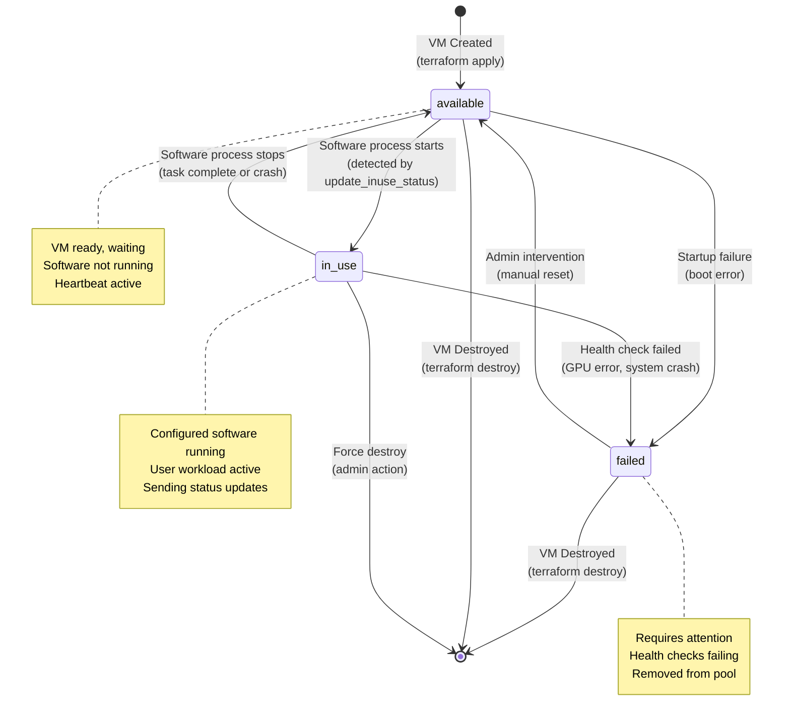
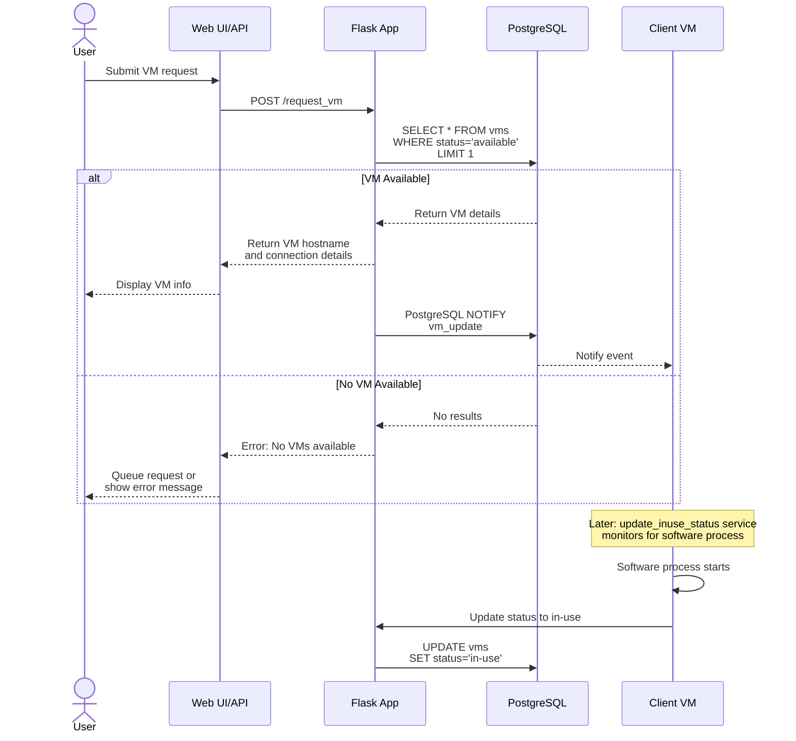
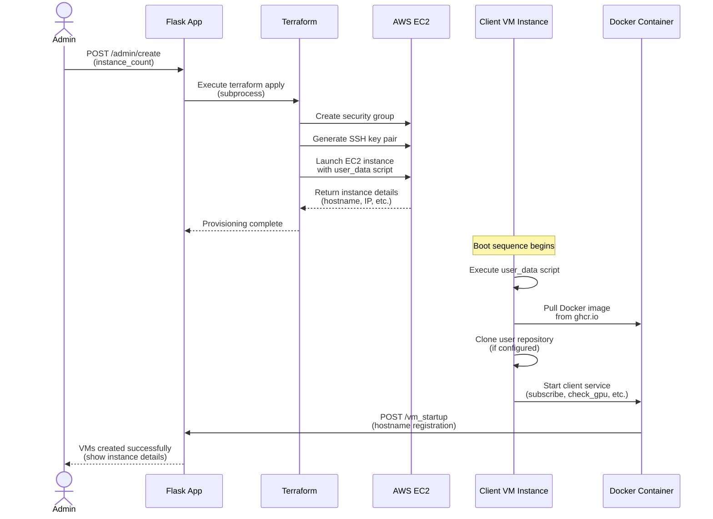
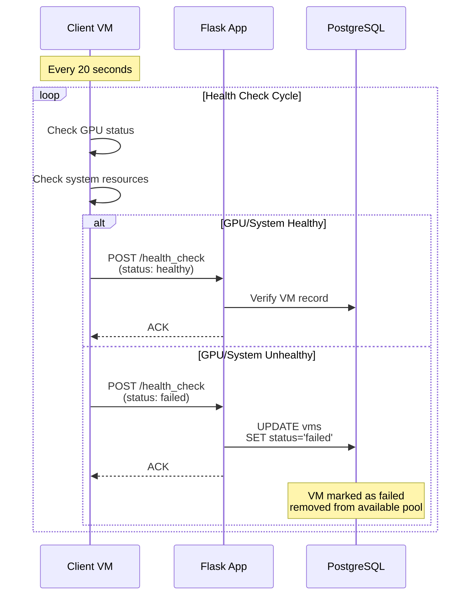

# Architecture

This page describes LabLink's architecture, components, and how they interact.

## System Overview

## Component Details

### Allocator Service

**Purpose**: Central management server for VM allocation and orchestration.

**Technology Stack**:

- **Flask**: Web application framework
- **PostgreSQL**: Relational database for VM state
- **SQLAlchemy**: ORM for database operations
- **Terraform**: Infrastructure provisioning
- **Docker**: Containerization

**Key Responsibilities**:

1. **Web Interface**:

   - Admin dashboard for VM management
   - VM creation interface
   - Instance listing and monitoring

2. **API Endpoints**:

   - `/request_vm`: Allocate VM to user
   - `/admin/create`: Create new VM instances
   - `/admin/instances`: List all instances
   - `/admin/destroy`: Destroy instances
   - `/vm_startup`: Client registration

3. **Database Management**:

   - Tracks VM states (available, in-use, failed)
   - PostgreSQL listen/notify for real-time updates
   - Automated triggers for state changes

4. **Infrastructure Orchestration**:
   - Spawns client VMs via Terraform
   - Manages AWS credentials
   - Handles security group configuration

**Configuration**: See `packages/allocator/src/lablink_allocator/conf/structured_config.py`

### Client Service

**Purpose**: Runs on dynamically created VMs to execute research workloads.

**Technology Stack**:

- **Python**: Service implementation
- **Docker**: Container runtime
- **Custom Software**: SLEAP or user-defined

**Key Responsibilities**:

1. **Health Monitoring**:

   - GPU health checks (every 20 seconds)
   - System resource monitoring
   - Reports status to allocator

2. **Allocator Communication**:

   - Heartbeat mechanism
   - Status updates (in-use, available)
   - Failure reporting

3. **Research Execution**:
   - Clones configured repository
   - Runs containerized research software
   - Executes user-defined CRD commands

**Configuration**: See `packages/client/src/lablink_client/conf/structured_config.py`

### Database Schema

**Table: `vms`**

| Column        | Type         | Description                         |
| ------------- | ------------ | ----------------------------------- |
| `id`          | SERIAL       | Primary key                         |
| `hostname`    | VARCHAR(255) | VM hostname/identifier              |
| `email`       | VARCHAR(255) | User email                          |
| `status`      | VARCHAR(50)  | VM status (available/in-use/failed) |
| `crd_command` | TEXT         | Command to execute on VM            |
| `created_at`  | TIMESTAMP    | Creation timestamp                  |
| `updated_at`  | TIMESTAMP    | Last update timestamp               |

**Triggers**:

- `notify_vm_update`: Sends PostgreSQL NOTIFY on row changes

### VM State Machine

The `status` field in the `vms` table follows this lifecycle:

**State Transitions**:

- **available → in_use**: Configured software process starts running on the VM
- **in_use → available**: Software process stops (task complete or process ends)
- **available/in_use → failed**: Health checks fail or errors occur
- **failed → available**: Admin manually resets and fixes the VM
- **any → [*]**: VM is destroyed via Terraform

**Note**: The `in_use` status indicates whether the configured software (e.g., SLEAP) is actively running on the VM, not whether a user has been assigned the VM. This is monitored by the `update_inuse_status` service which checks for the configured process.

### Infrastructure Components

#### Security Groups

**Allocator Security Group**:

- Port 80 (HTTP): Web interface and API
- Port 22 (SSH): Administrative access
- Port 5432 (PostgreSQL): Database connections from clients

**Client Security Groups**:

- Port 22 (SSH): Administrative access
- Egress: Full internet access for package downloads

#### Networking

- **Elastic IPs**: Static IPs for allocators (one per environment)
- **VPC**: Default VPC or custom (configurable)
- **Route 53** (Optional): DNS management for friendly URLs

#### Storage

- **S3 Buckets**: Terraform state storage

  - Separate state per environment (dev/test/prod)
  - Versioning enabled
  - Encrypted at rest

- **EBS Volumes**: Instance root volumes
  - Allocator: 30GB (configurable)
  - Clients: Depends on AMI

## Data Flow

### VM Request Flow

### VM Creation Flow

### Health Check Flow

## Deployment Environments

LabLink supports multiple isolated environments:

| Environment | Purpose           | Image Tag   | Terraform Backend  |
| ----------- | ----------------- | ----------- | ------------------ |
| `dev`       | Local development | `*-test`    | Local state        |
| `test`      | Staging/testing   | `*-test`    | `backend-test.hcl` |
| `prod`      | Production        | Pinned tags | `backend-prod.hcl` |

Each environment has:

- Separate Terraform state
- Unique resource naming (`-dev`, `-test`, `-prod` suffix)
- Independent AWS resources

## CI/CD Pipeline

See [Workflows](workflows.md) for detailed CI/CD architecture.

**Key Workflows**:

1. **Build Images** (`lablink-images.yml`):

   - Triggers on code changes
   - Builds allocator and client Docker images
   - Pushes to GitHub Container Registry

2. **Terraform Deploy** (`lablink-allocator-terraform.yml`):

   - Triggers on branch push or manual dispatch
   - Applies infrastructure changes
   - Supports environment selection

3. **Destroy** (`lablink-allocator-destroy.yml`):
   - Manual trigger only
   - Safely destroys environment resources

## Security Architecture

- **OIDC Authentication**: GitHub Actions authenticate to AWS without stored credentials
- **SSH Keys**: Auto-generated per environment, ephemeral artifacts
- **Secrets**: Managed via GitHub Secrets and AWS Secrets Manager
- **Network**: Security groups restrict access by port and source

See [Security](security.md) for detailed security considerations.

## Scalability Considerations

**Current Architecture**:

- Single allocator per environment
- Multiple clients per allocator
- Database handles concurrent requests

**Scaling Options**:

- Horizontal: Multiple allocators with load balancer
- Vertical: Larger instance types for allocator
- Database: RDS for managed PostgreSQL at scale

## Technology Choices

| Component     | Technology      | Rationale                          |
| ------------- | --------------- | ---------------------------------- |
| Web Framework | Flask           | Lightweight, Python ecosystem      |
| Database      | PostgreSQL      | LISTEN/NOTIFY, ACID compliance     |
| IaC           | Terraform       | Declarative, AWS support           |
| Containers    | Docker          | Portability, dependency isolation  |
| CI/CD         | GitHub Actions  | Native GitHub integration          |
| Config        | Hydra/OmegaConf | Structured configs, easy overrides |

## Next Steps

- **[Configuration](configuration.md)**: Customize components
- **[Deployment](deployment.md)**: Deploy the system
- **[Testing](testing.md)**: Test the codebase
