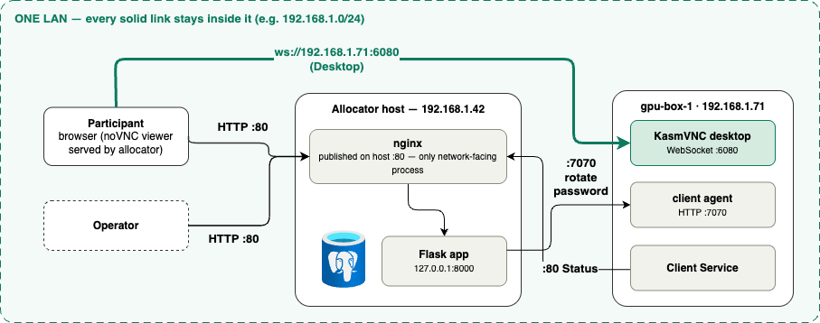
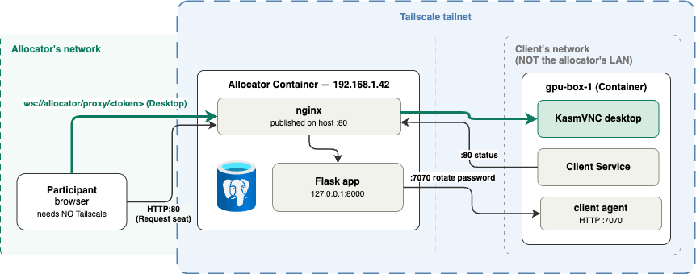
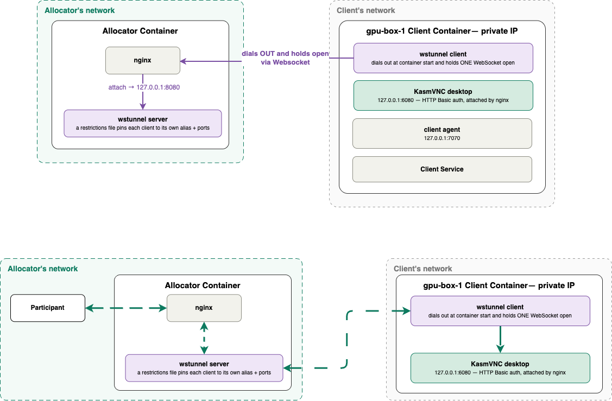

# Bring-Your-Own Clients

The CLI's other deployment mode. Instead of provisioning EC2 instances, the
allocator runs as a **local docker-compose stack** on a machine you already have,
and the client machines are boxes you register yourself. No AWS account, no
OpenTofu, no cloud bill.

Set `provider: manual` in your config and every command in the
[CLI Reference](../reference/cli.md) switches to this path.

[CLI Overview](index.md#two-providers) has the provider comparison; in short,
this path trades OpenTofu and an AWS bill for docker on your own hardware.

Good fits: a lab with GPU workstations already on a bench, a workshop on
institution-owned machines, or a scheduler-hosted workload (e.g. Run:AI) you can't
provision from OpenTofu.

Running the allocator itself on a container platform such as Run:AI? See
[External runtime](external-runtime.md) instead — same config and register
flow, but the allocator is submitted as a workload rather than started with
`lablink deploy` on a machine you control Docker on.

## Prerequisites

- **docker** on every client box; **docker** plus the **`docker compose` v2 plugin** on the allocator host.
- The CLI installed — see [Installation](installation.md).
- A network path from each client box to the allocator, or from the allocator to each client. Which direction you need is what [connectivity mode](#pick-a-connectivity-mode) decides.

`lablink doctor` checks the docker side for you under this provider. Once a box is
registered, `lablink client doctor` checks that box's own health — registration,
container, and log shipper. See the
[CLI Reference](../reference/cli.md#client-doctor).

## Pick a connectivity mode

`manual.connectivity` decides how a participant's browser reaches a client's
KasmVNC desktop. This is the one decision worth making before you deploy, because
it determines how each box registers and whether off-LAN participants can work at
all.

| Mode | How the desktop is reached | Use when |
|---|---|---|
| `lan_direct` (default) | The browser opens a WebSocket straight to the client's LAN IP. | Every client *and* every participant is on the allocator's own LAN. |
| `mesh_overlay` | The client joins a Tailscale tailnet; the allocator reaches it over the overlay and proxies the byte path through its own nginx. | Clients aren't on the allocator's LAN — e.g. a Run:AI-hosted workload. |
| `reverse_tunnel` | The client dials **out** to the allocator and holds one connection open. | The network won't carry Tailscale, or the box can't accept inbound connections at all. |

**`lan_direct`** — every hop stays inside one LAN. The browser loads the viewer
page from the allocator on port 80, then opens a WebSocket straight to the
client's KasmVNC on port 6080. The client reports status to the allocator on
port 80, and the allocator rotates the VNC password through the client agent on
port 7070.



**`mesh_overlay`** — the allocator container and the client both join a
Tailscale tailnet; the participant's browser needs no Tailscale. The browser
talks only to the allocator, whose nginx proxies the desktop WebSocket over the
overlay to the client. Status reports and password rotation cross the same
tailnet.



**`reverse_tunnel`** — the client dials out at container start and holds one
WebSocket open to the allocator's nginx, which hands it to a `wstunnel` server
inside the allocator container; a restrictions file pins each client to its
own alias and ports. The participant's browser talks only to the allocator, and
nginx sends the desktop bytes back down that held-open tunnel to the client's
KasmVNC, which listens on loopback behind HTTP Basic auth.



!!! warning "`lan_direct` cannot serve off-LAN participants"
    If participants are remote, pick `mesh_overlay` or `reverse_tunnel` —
    `lan_direct` combined with any exposure mode is rejected, and
    [Configuration](../configuration.md#manual-provider-options-manual) explains why.

Reaching the **allocator** from off-LAN is a separate axis —
`manual.participant_exposure`, covered on that same page.

`mesh_overlay` and `participant_exposure: tailscale_funnel` need a Tailscale
tailnet and auth key; `participant_exposure: cloudflare_tunnel` needs a
Cloudflare account, a domain, and a tunnel token. Set those up **before**
deploying — [Tailscale & Cloudflare Setup](tunnels.md) walks through each.

## Step 1: Configure

```bash
lablink configure
```

<div class="video-container">
  <video controls width="100%">
    <source src="../../assets/videos/byo-01-configure.mp4" type="video/mp4">
    Your browser does not support the video tag.
  </video>
</div>

*The manual path is seven screens and never shows the DNS/SSL one — that skip
is the `ssl.provider: none` note below, on camera. The clip sets both axes on
the connectivity screen: `reverse_tunnel` for the clients and
`cloudflare_tunnel` exposure at a hostname the operator owns. Other
combinations are the same flow with different radio buttons.*

The wizard writes `~/.lablink/config.yaml`. Choose the manual provider, then the
connectivity mode. Unlike the AWS path, it does **not** run `lablink setup`
afterwards — there is no remote state to bootstrap.

!!! note "The manual provider requires `ssl.provider: none`"
    The allocator image ships no TLS terminator — on the AWS path, Caddy is part of
    the infrastructure, not the container. `lablink deploy` exits with an error if
    `ssl.provider` is anything but `none`.

    The wizard handles this for you: picking the manual provider pins
    `ssl.provider: none`, disables DNS, and skips the DNS/SSL screen entirely. The
    error is only reachable from a **hand-edited** config — worth knowing, because
    `SSLConfig`'s own default is `letsencrypt`, so a config you wrote yourself or
    inherited from an AWS deployment will hit it.

    For public TLS, either use a
    [participant exposure mode](../configuration.md#manual-provider-options-manual)
    (which terminates TLS for you) or front the compose stack with your own reverse
    proxy.

A minimal LAN-only config:

```yaml
provider: manual
deployment_name: smith-lab
ssl:
  provider: none
manual:
  connectivity: lan_direct
```

## Step 2: Sanity check

```bash
lablink doctor
```

## Step 3: Deploy the allocator

```bash
lablink deploy
```

<div class="video-container">
  <video controls width="100%">
    <source src="../../assets/videos/byo-02-deploy.mp4" type="video/mp4">
    Your browser does not support the video tag.
  </video>
</div>

*Starts with Step 2's `lablink doctor`, then deploys. Because this deployment
is Cloudflare-exposed, `deploy` asks for the tunnel token first — hidden, like
the admin password — then publishes the allocator at the configured hostname
and verifies it before printing the summary. Recorded at 2×, with the
allocator image already pulled; a cold first run adds a few minutes of
download before anything in this clip happens.*

This renders the bundle — `docker-compose.yml`, `.env`, a copy of your
`config.yaml`, `custom-startup.sh`, an `allocator-url` file and, when a Tailscale
sidecar is needed, a compose override — into `~/.lablink/compose/<deployment_name>/`,
then runs `docker compose up -d` and waits for the allocator's health endpoint. The
allocator listens on host port 80. Postgres runs inside the allocator container,
with its data in a named volume.

You're prompted for an admin username and password unless `config.yaml` or a
previous deploy's rendered copy already has them. They're saved in the rendered
`config.yaml` under `~/.lablink/compose/…`, not in `~/.lablink/config.yaml`.

When it finishes, `deploy` prints what you need to onboard boxes:

```text
Deployment complete.
  Allocator URL (local): http://localhost
  Allocator URL (LAN):   http://192.168.1.42
  Admin URL:             http://192.168.1.42/admin
  Admin user:            admin
  Register token:        Xf3k9…

Next step: on each BYO box on the same LAN, run
  lablink client register --allocator-url http://192.168.1.42 --register-token Xf3k9…
```

Exposed deployments (`participant_exposure` other than `none`) print an
`Allocator URL (public)` line first, and the register command uses it.

The printed `client register` command is already tailored to your connectivity
mode — mesh-overlay and reverse-tunnel deployments get the extra flags filled in.
Copy it as-is.

!!! tip "Lost the token?"
    ```bash
    docker logs lablink-allocator | grep REGISTER_TOKEN
    ```

If `deploy` could only detect `localhost` and not a LAN address, the command it
prints is valid only for a client on the allocator host itself. Substitute the
host's real LAN IP or hostname before handing it to anyone else.

Deploying with a connectivity or exposure mode that needs Tailscale also requires
an auth key on the **first** deploy:

```bash
lablink deploy --tailscale-authkey tskey-auth-...
```

Redeploys carry the previous key forward from the deployment's `.env`, so you only
pass it again to rotate it. How to generate the key (and the Cloudflare tunnel
token, for that exposure mode) is covered in
[Tailscale & Cloudflare Setup](tunnels.md).

## Step 4: Register each box

Run this **on the machine you're adding**, not on the allocator host:

```bash
lablink client register --allocator-url http://192.168.1.42 --register-token Xf3k9…
```

<div class="video-container">
  <video controls width="100%">
    <source src="../../assets/videos/byo-03-register.mp4" type="video/mp4">
    Your browser does not support the video tag.
  </video>
</div>

*Recorded **on the box**, not on the allocator host — this is the machine being
added, which is why the command is the one you run there rather than beside the
allocator. The box reaches the allocator at its public `https://` hostname, so
it needn't be on the allocator's LAN at all. `--tunnel` makes it dial out and
hold the connection open; the auto-detected values report no LAN IP, because
nothing ever dials in to it. The client image was pulled beforehand; a cold run
adds a long download.*

It auto-detects hostname, LAN IP, machine identity, and GPU presence/model, writes
the returned secrets to `~/.lablink/client.env` (mode `0600`), and `docker run`s the
client container. Every auto-detected value has an override flag if you need one.

The registration shape has to match the allocator's configured connectivity, or the
allocator rejects it with a 400 — see
[`client register`](../reference/cli.md#client-register) for which flags each mode
requires.

The allocator's admin UI also renders a ready-to-paste command at
**`/admin/byo-onboarding`**, with the flags already matched to your mode. That's the
easiest thing to send to someone else who owns a box.

!!! note "Registering ahead of time, from somewhere else"
    For mesh-overlay and reverse-tunnel clients, `register` defaults to running the
    container right here (`--run-locally`). Add `--no-run-locally` to instead print
    the secrets for pasting into a separate workload submission — useful when you're
    registering a scheduler-hosted workload from your laptop rather than from inside
    the workload. In that case you must also pass `--hostname` and
    `--machine-identity`, since there's nothing local to auto-detect from.

    The printed env includes `SHIP_LOGS=1`: the client container ships its own
    output stream to the allocator's per-VM logs page (there is no host-side
    shipper in any BYO shape). Keep that line in your paste, or the logs page
    stays empty for the client.

If docker is missing on the box, `register` keeps the env file so you can install
docker and re-run with `--force`.

Confirm the box landed in the pool:

```bash
lablink status
```

## Day-to-day

| Task | Command | Manual-provider notes |
|---|---|---|
| Check health | `lablink status` | Compose container status, the allocator's health endpoint, and a table of registered clients. No cost estimate — the hardware is yours. |
| Read logs | `lablink logs` | The same TUI as on AWS: the local `lablink-allocator` container plus every registered box, whose client container ships its own logs to the allocator. |
| Add a box | `lablink client register` | Run on the new box. |
| Remove a box | `lablink client unregister` | Run on that box. |

`client launch` and `client destroy` no-op with a message pointing you at
`client register` / `client unregister`. Every other command, `stats` and
`export-metrics` included, behaves as it does on the AWS path.

## Removing a box

On the box itself:

```bash
lablink client unregister
```

Notifies the allocator best-effort, removes the `lablink-client` container, and
deletes the env file. It's idempotent and safe to run after the allocator is already
gone.

For a mesh-overlay client, `unregister` deliberately **keeps** the Tailscale node
identity so re-registering returns to the same tailnet node under the same name. To
deliberately start fresh:

```bash
lablink client reset-overlay
```

!!! warning "Reset does not delete the old tailnet machine"
    The previous node goes offline still holding its name, so the next join gets a
    numeric suffix (`-1`, `-2`, …) until you delete the stale machine in the
    Tailscale admin console. The container must already be removed, too — docker
    won't detach a volume that's in use.

## Tearing down

```bash
lablink destroy              # stops the stack, wipes the Postgres volume and working dir
lablink destroy --keep-data  # stops the stack, preserves both
```

<div class="video-container">
  <video controls width="100%">
    <source src="../../assets/videos/byo-04-status-destroy.mp4" type="video/mp4">
    Your browser does not support the video tag.
  </video>
</div>

*Back on the allocator host: `lablink status` with the box in the pool, then
`destroy`. Recorded at 2×.*

`--keep-data` is the one to use between sessions of the same workshop — sessions and
registration history survive the next `lablink deploy`.

To also remove the compose working directory and its volumes outright:

```bash
lablink cleanup
```

Under the manual provider this runs `docker compose down --volumes` and deletes
`~/.lablink/compose/<deployment_name>/` — immediately, with no confirmation prompt.
`--dry-run` prints what would go instead.

## Next steps

- [Configuration](../configuration.md#manual-provider-options-manual) — every `manual.*` setting, including how to publish the allocator to off-LAN participants.
- [CLI Reference](../reference/cli.md#client-fleet-commands) — full flag list for the `client` commands.
- [Troubleshooting](../troubleshooting.md) — general LabLink issues.
