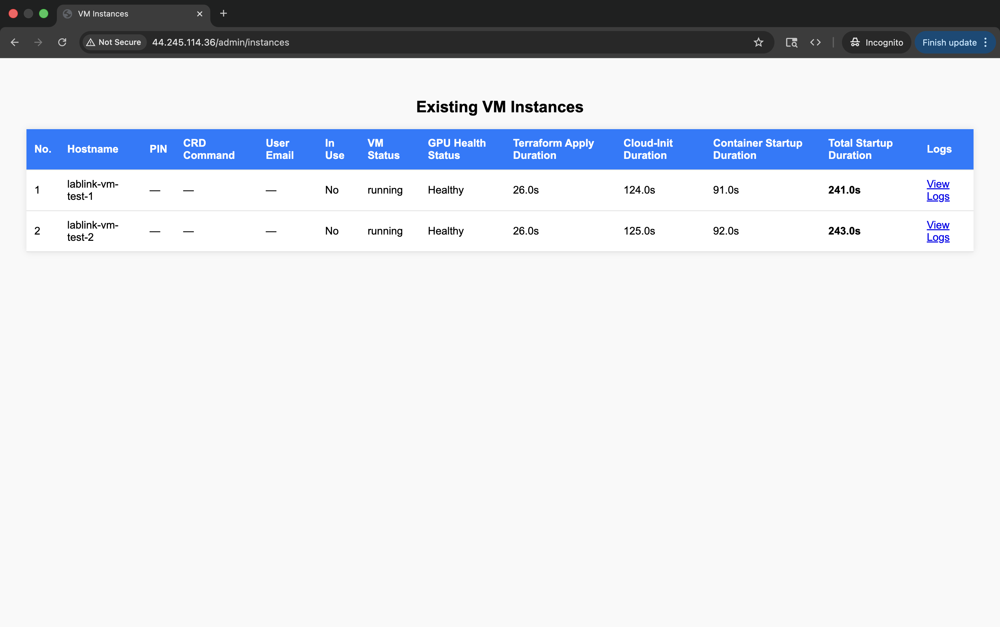

# LabLink

**Cloud-based virtual teaching lab accessible through Chrome browser.**

Run a hands-on software workshop -- students get a full desktop with your software pre-installed, you just share a link.

---

## What You Get

- :material-monitor: **For Students**

    ---

    Students click a link, get a full cloud desktop with your software ready to go. No installation, no setup -- just a Chrome browser.

- :material-view-dashboard: **For Admins**

    ---

    Manage VMs from a web dashboard. Create, monitor, and destroy VMs with a few clicks. Download participant work at the end.

    

## How It Works

1. **Deploy** an allocator server to AWS ([Quickstart](quickstart.md))
2. **Spin up VMs** from the admin panel before your workshop ([Workshop Guide](workshop-guide.md))
3. **Share a link** -- students visit the URL, get assigned a VM, and start working

LabLink is **software-agnostic**. It ships with [SLEAP](https://sleap.ai) as the default, but you can [adapt it for any software](adapting.md) that runs in Docker.

---

## Getting Started

=== "Prerequisites"

    :material-clipboard-check-outline: Install the required tools: AWS CLI, GitHub CLI, and Git.

    [:octicons-arrow-right-24: View requirements](prerequisites.md)

=== "Quickstart"

    :material-rocket-launch: Deploy LabLink to AWS using the template repository and automated setup scripts.

    [:octicons-arrow-right-24: Get started](quickstart.md)

=== "Guides"

    :material-book-open-variant: Adapt for your software, run a workshop, configure your deployment.

    [:octicons-arrow-right-24: Adapting for your software](adapting.md)

## Explore the Docs

- :material-swap-horizontal: **Adapting for Your Software**

    ---

    Install your own tutorial software on client VMs and customize the environment.

    [:octicons-arrow-right-24: Adapting](adapting.md)

- :material-cog: **Configuration**

    ---

    Customize instance types, machine images, DNS, SSL, and monitoring settings.

    [:octicons-arrow-right-24: Configuration](configuration.md)

- :material-calendar-check: **Workshop Guide**

    ---

    Step-by-step guide for running a workshop: create VMs, share links, collect data, clean up.

    [:octicons-arrow-right-24: Workshop Guide](workshop-guide.md)

- :material-rocket-launch: **Deployment**

    ---

    CI/CD workflows, production deployment, and environment management.

    [:octicons-arrow-right-24: Deployment](deployment.md)

## Resources

- [:fontawesome-brands-github: GitHub](https://github.com/talmolab/lablink) - Source code, issues, and contributions
- [:material-file-document-multiple: Template](https://github.com/talmolab/lablink-template) - Ready-to-use deployment template
- [:material-help-circle: Support](https://github.com/talmolab/lablink/issues) - Report issues or request features

---

*Built by [Talmo Lab](https://talmolab.org) at the Salk Institute for Biological Studies.*
