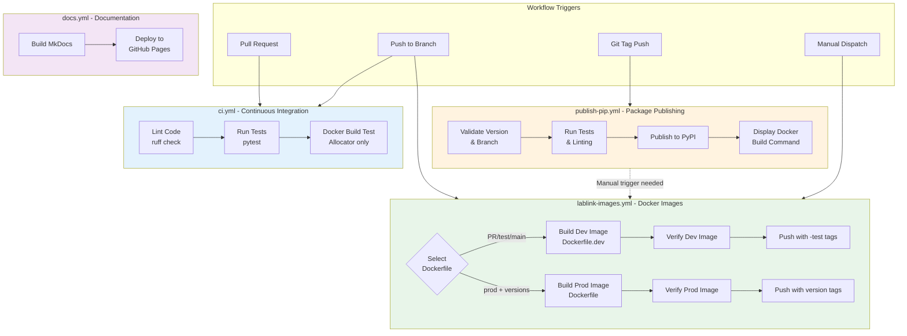
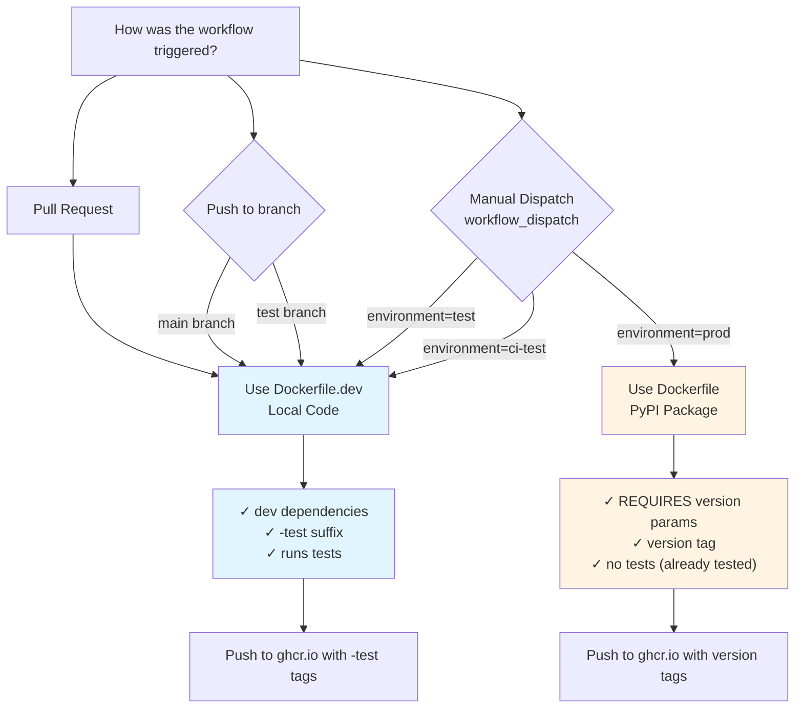
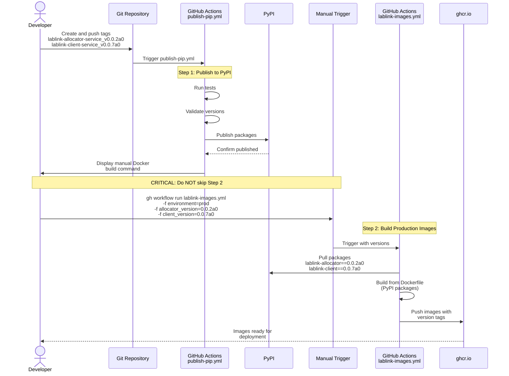

# Workflows

This guide explains LabLink's CI/CD workflows, how they work, and how to customize them.

## Overview

LabLink uses GitHub Actions for continuous integration and deployment. The workflows automate:

- Python package publishing to PyPI
- Docker image building and publishing to GHCR
- Testing and validation (linting, unit tests, Docker builds)
- Documentation deployment to GitHub Pages

**Note**: Infrastructure deployment workflows (Terraform) have been moved to the [LabLink Template Repository](https://github.com/talmolab/lablink-template).

### CI/CD Pipeline Overview



## Workflow Files

All workflows are located in `.github/workflows/`:

| Workflow File                                     | Purpose                                 | Trigger                                |
| ------------------------------------------------- | --------------------------------------- | -------------------------------------- |
| [`ci.yml`](#continuous-integration-workflow)      | Unit tests, linting, Docker build tests | PRs, pushes                            |
| [`publish-pip.yml`](#package-publishing-workflow) | Publish Python packages to PyPI         | Git tags, manual dispatch              |
| [`lablink-images.yml`](#image-building-workflow)  | Build and push Docker images to GHCR    | Push to branches, PRs, package publish |
| [`docs.yml`](#documentation-workflow)             | Build and deploy documentation          | Pushes to main, docs changes           |

## Continuous Integration Workflow

**File**: `.github/workflows/ci.yml`

### Purpose

Runs tests, linting, and Docker build verification on every pull request affecting service code.

### Triggers

- Pull requests with changes to:
  - `packages/client/**`
  - `packages/allocator/**`
  - `.github/workflows/ci.yml`

### Jobs

1. **Lint** - Checks code quality with `ruff`

   - Allocator service: `uv run ruff check src tests`
   - Client service: `uv run ruff check src tests`

2. **Test** - Runs unit tests with `pytest`

   - Allocator: `uv run pytest tests --cov=. --cov-report=xml`
   - Client: `uv run pytest tests --cov=src/lablink_client_service --cov-report=xml`

3. **Docker Build Test (Allocator Only)**
   - Builds `packages/allocator/Dockerfile.dev` using `uv sync --extra dev`
   - Verifies virtual environment activation
   - Verifies console script entry points are importable and callable
   - Verifies console scripts exist (`lablink-allocator`, `generate-init-sql`)
   - Verifies dev dependencies installed (pytest, ruff, coverage with versions)
   - Verifies package imports (main, database, get_config)
   - Verifies `uv sync` installation
   - **Note**: Client Docker build test skipped due to large image size (~6GB with CUDA)

### Example Workflow Run

```
PR opened → ci.yml triggered
  ├─ Lint allocator-service ✓
  ├─ Lint client-service ✓
  ├─ Test allocator-service ✓
  ├─ Test client-service ✓
  └─ Docker Build Test - Allocator ✓
     ├─ Venv activated: /app/lablink-allocator-service/.venv
     ├─ Entry points importable: main(), generate_init_sql.main() ✓
     ├─ Console scripts: lablink-allocator, generate-init-sql ✓
     ├─ Dev dependencies: pytest 8.4.2, ruff, coverage 7.10.7 ✓
     ├─ Package imports: main.main, database.PostgresqlDatabase, get_config ✓
     └─ Installation: Package installed via uv sync ✓
```

## Package Publishing Workflow

**File**: `.github/workflows/publish-pip.yml`

### Purpose

Publishes Python packages to PyPI with safety guardrails.

### Triggers

- **Git tags** matching package name pattern (e.g., `lablink-allocator-service_v0.0.2a0`)
- **Manual dispatch** with dry-run option

### Features

- Version verification (prevents republishing same version)
- Metadata validation
- Linting and tests before publishing
- Dry-run mode for testing
- Per-package control (publish allocator/client independently)

### Input Parameters (Manual Dispatch)

| Parameter    | Description              | Options                                               | Default  |
| ------------ | ------------------------ | ----------------------------------------------------- | -------- |
| `package`    | Which package to publish | `lablink-allocator-service`, `lablink-client-service` | Required |
| `dry_run`    | Test without publishing  | `true`, `false`                                       | `true`   |
| `skip_tests` | Skip test suite          | `true`, `false`                                       | `false`  |

### Workflow Steps

1. **Determine which packages to publish** (from tag or input)
2. **Run guardrails**:
   - Verify release from main branch (for releases)
   - Validate version matches tag
   - Validate package metadata
   - Run linting with `ruff`
   - Run unit tests (unless skipped)
3. **Build package** with `uv build`
4. **Publish to PyPI** (unless dry-run)
5. **Display manual Docker build instructions**

### Package Versioning

- **Format**: `{package-name}_v{version}`
- **Examples**:
  - `lablink-allocator-service_v0.0.2a0`
  - `lablink-client-service_v0.0.7a0`

### Example: Publishing a Release

```bash
# 1. Create and push tags
git tag lablink-allocator-service_v0.0.2a0
git tag lablink-client-service_v0.0.7a0
git push origin lablink-allocator-service_v0.0.2a0 lablink-client-service_v0.0.7a0

# 2. Workflow automatically:
#    - Detects tags
#    - Runs tests for each package
#    - Publishes to PyPI
#    - Displays Docker build instructions

# 3. Manually trigger Docker image build (see below)
gh workflow run lablink-images.yml \
  -f environment=prod \
  -f allocator_version=0.0.2a0 \
  -f client_version=0.0.7a0
```

### Building Docker Images After Publishing

**CRITICAL**: After successfully publishing to PyPI, you **MUST** manually trigger Docker image builds to create production images with the new package version. This is NOT automatic.

**Why manual?** Production images should only be built with explicit version numbers to ensure traceability. Automatic builds use local code and `-test` suffix - they are NOT production images.

**Step-by-Step Process:**

1. **Publish packages to PyPI** (either via git tags or manual dispatch of `publish-pip.yml`)
2. **Wait for publish workflow to complete** - Verify packages are on PyPI
3. **Manually trigger Docker image build** using one of the methods below

**Option 1: Using GitHub CLI** (recommended):

```bash
# Build both images with their respective versions
gh workflow run lablink-images.yml \
  -f environment=prod \
  -f allocator_version=0.0.2a0 \
  -f client_version=0.0.7a0
```

**Option 2: Using GitHub UI**:

1. Go to [Actions → Build and Push Docker Images](https://github.com/talmolab/lablink/actions/workflows/lablink-images.yml)
2. Click "Run workflow"
3. Select branch: `main`
4. **Set environment: `prod`** (required!)
5. **Enter allocator version: `0.0.2a0`** (required!)
6. **Enter client version: `0.0.7a0`** (required!)
7. Click "Run workflow"

**What happens:**

- Pulls packages from PyPI with specified versions
- Builds Docker images using production `Dockerfile`
- Tags images with version numbers (e.g., `:0.0.2a0`, `:linux-amd64-0.0.2a0`)
- Tags images with `:latest` for convenience
- Verifies images work correctly
- **No `-test` suffix** on production images

**Common mistake**: Forgetting this step means your packages exist on PyPI but there are no corresponding Docker images, causing deployment failures.

**Important Note**: Pushing to `main` branch will NOT create production images. It will create development images with `-test` suffix using local code, not published packages.

## Image Building Workflow

**File**: `.github/workflows/lablink-images.yml`

### Purpose

Builds and publishes Docker images to GitHub Container Registry (ghcr.io) using either local code (dev) or published packages (prod), then verifies the images work correctly.

### Triggers

- **Pull requests**: Build dev images with `-test` tag
- **Push to `test` branch**: Build dev images with `-test` tag
- **Push to `main`**: Build dev images with `-test` tag
- **Manual dispatch with `environment=test` or `environment=ci-test`**: Build dev images with `-test` tag
- **Manual dispatch with `environment=prod`**: Build production images from PyPI (REQUIRES version parameters)

### Workflow Decision Logic

The workflow automatically selects between development (`Dockerfile.dev`) and production (`Dockerfile`) builds based on the trigger type and inputs.

**Key Principle**: Production images from PyPI are ONLY created via manual dispatch with `environment=prod` and explicit version numbers. All automatic builds (PR, push to test/main) use local code.

#### Decision Flow Diagram



#### Complete Decision Table

| Trigger Type        | Branch/Ref | Environment Input | Dockerfile Used  | Package Source          | Version Required? | Tag Suffix | Dev Tests Run? | Use Case                   |
| ------------------- | ---------- | ----------------- | ---------------- | ----------------------- | ----------------- | ---------- | -------------- | -------------------------- |
| **Pull Request**    | any        | N/A               | `Dockerfile.dev` | Local code              | No                | `-test`    | Yes            | CI validation              |
| **Push**            | `test`     | N/A               | `Dockerfile.dev` | Local code              | No                | `-test`    | Yes            | Staging/testing            |
| **Push**            | `main`     | N/A               | `Dockerfile.dev` | Local code              | No                | `-test`    | Yes            | Latest development         |
| **Manual Dispatch** | any        | `test`            | `Dockerfile.dev` | Local code              | No                | `-test`    | Yes            | Test specific changes      |
| **Manual Dispatch** | any        | `ci-test`         | `Dockerfile.dev` | Local code              | No                | `-test`    | Yes            | CI testing with S3 backend |
| **Manual Dispatch** | any        | `prod`            | `Dockerfile`     | PyPI (explicit version) | **YES**           | none       | No             | **Production releases**    |

#### Key Points

- **Development builds** (`Dockerfile.dev`):

  - Copy local source code into image
  - Install with `uv sync --extra dev` from lockfile
  - Include dev dependencies (pytest, ruff)
  - Run verification tests in CI
  - **Always** have `-test` suffix
  - Fast iteration, reproducible via lockfile

- **Production builds** (`Dockerfile`):

  - Install packages from PyPI using `uv pip install`
  - **ONLY** created via manual dispatch with `environment=prod`
  - **REQUIRES** explicit `allocator_version` and `client_version`
  - No dev dependencies (smaller image)
  - No tests run (package already tested before publishing)
  - Tagged with version number for traceability
  - **No suffix** - clean version tags
  - Directly traceable to specific package release

- **Version Validation**:
  - Manual dispatch with `environment=prod` **requires** both `allocator_version` and `client_version`
  - Workflow fails with clear error if versions are missing
  - Prevents untrackable production images

#### Production Release Workflow

**IMPORTANT**: Production Docker images must be built AFTER publishing packages to PyPI. This is a **manual two-step process**:



**Step 1: Publish packages to PyPI**

```bash
# Create and push git tags
git tag lablink-allocator-service_v0.0.2a0
git tag lablink-client-service_v0.0.7a0
git push origin lablink-allocator-service_v0.0.2a0 lablink-client-service_v0.0.7a0

# publish-pip.yml workflow automatically:
#   - Runs tests
#   - Publishes to PyPI
#   - Displays manual Docker build command
```

**Step 2: Manually trigger Docker image build** (required)

```bash
# After packages are published, build production images
gh workflow run lablink-images.yml \
  -f environment=prod \
  -f allocator_version=0.0.2a0 \
  -f client_version=0.0.7a0
```

**Critical**: Do NOT skip Step 2. Without it, your published packages won't have corresponding Docker images, and deployments will fail.

#### Development/Testing Workflows

**Automatic (no action needed):**

```bash
# Push to test branch → automatically builds dev images with -test suffix
git push origin test

# Push to main → automatically builds dev images with -test suffix
git push origin main
```

**Manual testing:**

```bash
# Test specific changes without pushing
gh workflow run lablink-images.yml -f environment=test

# For CI testing with S3 backend (e.g., testing Terraform configurations)
gh workflow run lablink-images.yml -f environment=ci-test
```

#### Common Mistakes

**Forgetting to build Docker images after publishing packages**

```bash
# Published to PyPI but forgot Step 2
git push origin lablink-allocator-service_v0.0.2a0
# Result: Package exists but no Docker image with version tag
```

**Trying to build production images without versions**

```bash
gh workflow run lablink-images.yml -f environment=prod
# Error: Production builds require both allocator_version and client_version
```

**Correct production release**

```bash
# 1. Publish packages
git push origin lablink-allocator-service_v0.0.2a0 lablink-client-service_v0.0.7a0

# 2. Wait for publish-pip.yml to complete successfully

# 3. Build Docker images with explicit versions
gh workflow run lablink-images.yml \
  -f environment=prod \
  -f allocator_version=0.0.2a0 \
  -f client_version=0.0.7a0
```

### Smart Dockerfile Selection

The workflow uses different Dockerfiles depending on whether you're building for development/testing or production:

| Trigger                      | Dockerfile Used  | Package Source              | Installation Method   | Tests Run? | Suffix  | Version Tagged? |
| ---------------------------- | ---------------- | --------------------------- | --------------------- | ---------- | ------- | --------------- |
| PR                           | `Dockerfile.dev` | Local code (copied)         | `uv sync --extra dev` | Yes        | `-test` | No              |
| Push to `test`               | `Dockerfile.dev` | Local code (copied)         | `uv sync --extra dev` | Yes        | `-test` | No              |
| Push to `main`               | `Dockerfile.dev` | Local code (copied)         | `uv sync --extra dev` | Yes        | `-test` | No              |
| Manual `environment=test`    | `Dockerfile.dev` | Local code (copied)         | `uv sync --extra dev` | Yes        | `-test` | No              |
| Manual `environment=ci-test` | `Dockerfile.dev` | Local code (copied)         | `uv sync --extra dev` | Yes        | `-test` | No              |
| Manual `environment=prod`    | `Dockerfile`     | **PyPI (explicit version)** | `uv pip install`      | No         | none    | **Yes**         |

**Key Distinction**:

- All automatic builds = Development images with `-test` suffix
- Manual production builds = Production images without suffix, with version tags

### Image Tagging Strategy

Docker images are tagged differently based on how they are triggered. This allows you to reference specific versions, latest development builds, or stable releases.

#### Allocator Image Tags

**Manual trigger with package version (recommended for production):**

```bash
gh workflow run lablink-images.yml \
  -f environment=prod \
  -f allocator_version=0.0.2a0 \
  -f client_version=0.0.7a0
```

Creates images tagged with:

- `ghcr.io/talmolab/lablink-allocator-image:0.0.2a0` - **Version-specific tag**
- `ghcr.io/talmolab/lablink-allocator-image:linux-amd64-0.0.2a0` - Platform + version
- `ghcr.io/talmolab/lablink-allocator-image:linux-amd64-latest` - Latest for platform
- `ghcr.io/talmolab/lablink-allocator-image:linux-amd64` - Platform tag
- `ghcr.io/talmolab/lablink-allocator-image:linux-amd64-terraform-1.4.6` - Metadata tag
- `ghcr.io/talmolab/lablink-allocator-image:linux-amd64-postgres-15` - Metadata tag
- `ghcr.io/talmolab/lablink-allocator-image:<sha>` - Git commit SHA
- `ghcr.io/talmolab/lablink-allocator-image:latest` - Latest stable

**Push to main branch (automatic):**

```bash
git push origin main
```

Creates images tagged with (no version-specific tags):

- `ghcr.io/talmolab/lablink-allocator-image:linux-amd64-latest`
- `ghcr.io/talmolab/lablink-allocator-image:linux-amd64`
- `ghcr.io/talmolab/lablink-allocator-image:<sha>`
- `ghcr.io/talmolab/lablink-allocator-image:latest`
- Plus metadata tags

**Pull requests / test branch (automatic):**

```bash
git push origin test
```

Creates images tagged with `-test` suffix:

- `ghcr.io/talmolab/lablink-allocator-image:linux-amd64-test`
- `ghcr.io/talmolab/lablink-allocator-image:<sha>-test`
- Plus metadata tags with `-test` suffix

#### Client Image Tags

**Manual trigger with package version (recommended for production):**

```bash
gh workflow run lablink-images.yml \
  -f environment=prod \
  -f allocator_version=0.0.2a0 \
  -f client_version=0.0.7a0
```

Creates images tagged with:

- `ghcr.io/talmolab/lablink-client-base-image:0.0.7a0` - **Version-specific tag**
- `ghcr.io/talmolab/lablink-client-base-image:linux-amd64-0.0.7a0` - Platform + version
- `ghcr.io/talmolab/lablink-client-base-image:linux-amd64-latest` - Latest for platform
- `ghcr.io/talmolab/lablink-client-base-image:linux-amd64-nvidia-cuda-11.6.1-cudnn8-runtime-ubuntu20.04`
- `ghcr.io/talmolab/lablink-client-base-image:linux-amd64-ubuntu20.04-nvm-0.40.2-uv-0.6.8-miniforge3-24.11.3`
- `ghcr.io/talmolab/lablink-client-base-image:<sha>` - Git commit SHA
- `ghcr.io/talmolab/lablink-client-base-image:latest` - Latest stable

**Push to main branch (automatic):**

Creates same tags as manual trigger except without version-specific tags (`0.0.7a0`, `linux-amd64-0.0.7a0`)

**Pull requests / test branch (automatic):**

Creates same tags as main but with `-test` suffix

#### Tag Usage in Terraform

For production deployments, always use version-specific tags in your Terraform configuration:

```hcl
# terraform.tfvars or -var flags
allocator_image_tag = "0.0.2a0"  # Pin to specific version
client_image_tag    = "0.0.7a0"  # Pin to specific version
```

For development/testing, you can use environment-specific tags:

```hcl
# Development
allocator_image_tag = "linux-amd64-test"

# Latest main branch
allocator_image_tag = "latest"
```

#### Summary Table

| Trigger Type      | Environment | Version Tag? | Suffix  | Use Case                   |
| ----------------- | ----------- | ------------ | ------- | -------------------------- |
| Manual w/ version | `prod`      | ✅ Yes       | None    | Production releases        |
| Push to main      | N/A         | ❌ No        | `-test` | Latest development         |
| Push to test      | N/A         | ❌ No        | `-test` | Staging/testing            |
| Pull request      | N/A         | ❌ No        | `-test` | CI/CD validation           |
| Manual dispatch   | `test`      | ❌ No        | `-test` | Test specific changes      |
| Manual dispatch   | `ci-test`   | ❌ No        | `-test` | CI testing with S3 backend |

### Workflow Jobs

#### 1. Build Job

1. **Select Dockerfile**

   - Dev: Uses `Dockerfile.dev` (copies local source, uses `uv sync`)
   - Prod: Uses `Dockerfile` (installs from PyPI with `uv pip install`)

2. **Build Allocator Image**

   - Context: Repository root
   - Dockerfile: `packages/allocator/Dockerfile[.dev]`
   - Tags: `ghcr.io/talmolab/lablink-allocator-image:<tags>`

3. **Build Client Image**

   - Context: Repository root
   - Dockerfile: `packages/client/Dockerfile[.dev]`
   - Tags: `ghcr.io/talmolab/lablink-client-base-image:<tags>`

4. **Push to Registry**
   - Authenticates to ghcr.io
   - Pushes images with all applicable tags

#### 2. Verify Allocator Job

Runs after successful build, pulls and tests the allocator image:

- **Image Selection**: Pulls using SHA-based tag (e.g., `:linux-amd64-<sha>-test`) to ensure exact image match and prevent race conditions from concurrent builds
- **Virtual Environment**: Activates venv at `/app/.venv`
- **Entry Points**: Verifies `main()` and `generate_init_sql.main()` are importable and callable
- **Console Scripts**: Verifies `lablink-allocator` and `generate-init-sql` exist and execute
- **Package Imports**: Tests importing `main`, `database.PostgresqlDatabase`, `get_config`
- **Dev Dependencies** (dev images only): Verifies pytest, ruff with versions

#### 3. Verify Client Job

Runs after successful build, pulls and tests the client image:

- **Image Selection**: Pulls using SHA-based tag (e.g., `:linux-amd64-<sha>-test`) to ensure exact image match and prevent race conditions from concurrent builds
- **Virtual Environment**: Activates venv at `/home/client/.venv`
- **Entry Points**: Verifies `check_gpu.main()`, `subscribe.main()`, `update_inuse_status.main()` are importable and callable
- **Console Scripts**: Verifies `check_gpu`, `subscribe`, `update_inuse_status` exist and execute
- **Package Imports**: Tests importing subscribe, check_gpu, update_inuse_status modules
- **UV Availability**: Verifies `uv` command and version
- **Dev Dependencies** (dev images only): Verifies pytest, ruff with versions

### Example Workflow Run

```
PR opened → lablink-images.yml triggered
  └─ Build Job
     ├─ Build allocator dev image ✓
     ├─ Build client dev image ✓
     └─ Push to ghcr.io ✓
  └─ Verify Allocator Job
     ├─ Pull ghcr.io/.../lablink-allocator-image:linux-amd64-abc1234-test
     ├─ Venv activated: /app/.venv ✓
     ├─ Entry points callable: main(), generate_init_sql.main() ✓
     ├─ Console scripts: lablink-allocator, generate-init-sql ✓
     ├─ Imports: main.main, database.PostgresqlDatabase, get_config ✓
     └─ Dev deps: pytest 8.4.2, ruff ✓
  └─ Verify Client Job
     ├─ Pull ghcr.io/.../lablink-client-base-image:linux-amd64-abc1234-test
     ├─ Venv activated: /home/client/.venv ✓
     ├─ Entry points callable: check_gpu.main(), subscribe.main(), update_inuse_status.main() ✓
     ├─ Console scripts: check_gpu, subscribe, update_inuse_status ✓
     ├─ Imports: subscribe.main, check_gpu.main, update_inuse_status.main ✓
     ├─ UV: uv 0.6.8 ✓
     └─ Dev deps: pytest 8.4.2, ruff ✓
```

### Customization

To modify image building:

```yaml
# .github/workflows/lablink-images.yml

# Build for different platforms
- name: Build and push
  uses: docker/build-push-action@v5
  with:
    platforms: linux/amd64,linux/arm64 # Add ARM support
    push: ${{ github.event_name != 'pull_request' }}
    tags: ${{ steps.meta.outputs.tags }}
```

## Terraform Deployment Workflow

**File**: `.github/workflows/lablink-allocator-terraform.yml`

### Purpose

Deploys LabLink infrastructure to AWS using Terraform.

### Triggers

- **Push to `test` branch**: Automatic test deployment
- **Workflow dispatch**: Manual deployment (dev/test/prod)
- **Repository dispatch**: Programmatic deployment (for prod)

### Input Parameters (Manual Dispatch)

| Parameter     | Description                                   | Required      | Default |
| ------------- | --------------------------------------------- | ------------- | ------- |
| `environment` | Environment to deploy (`dev`, `test`, `prod`) | Yes           | `dev`   |
| `image_tag`   | Docker image tag (required for prod)          | For prod only | N/A     |

All deployments use the `lablink-infrastructure/` directory structure with configuration at `lablink-infrastructure/config/config.yaml`.

### Workflow Steps

#### 1. Environment Determination

```
Push to 'test' branch → env=test
Manual dispatch → env=<user input>
Repository dispatch → env=<payload>
```

#### 2. AWS Authentication

Uses OpenID Connect (OIDC) to assume IAM role:

```yaml
- name: Configure AWS credentials via OIDC
  uses: aws-actions/configure-aws-credentials@v3
  with:
    role-to-assume: arn:aws:iam::711387140753:role/github_lablink_repository-AE68499B37C7
    aws-region: us-west-2
```

**No AWS credentials stored in GitHub!**

#### 3. Terraform Initialization

```bash
# Dev (local state)
terraform init

# Test/Prod (remote state)
terraform init -backend-config=backend-<env>.hcl
```

#### 4. Validation

```bash
terraform fmt -check  # Check formatting
terraform validate    # Validate syntax
```

#### 5. Planning

```bash
terraform plan \
  -var="resource_suffix=<env>" \
  -var="allocator_image_tag=<tag>"
```

#### 6. Application

```bash
terraform apply -auto-approve \
  -var="resource_suffix=<env>" \
  -var="allocator_image_tag=<tag>"
```

#### 7. Artifact Handling

- Extracts SSH private key from Terraform output
- Saves as artifact (expires in 1 day)
- Provides download link in workflow summary

#### 8. Failure Handling

If `terraform apply` fails:

```bash
terraform destroy -auto-approve
```

Automatically cleans up partial deployments.

### Example Workflow Run

**Scenario**: Deploy to production

```
1. Navigate to Actions → Terraform Deploy → Run workflow
2. Select:
   - Environment: prod
   - Image tag: v1.0.0
3. Workflow starts:
   - Authenticates to AWS via OIDC
   - Initializes Terraform with backend-prod.hcl
   - Plans infrastructure
   - Applies changes
   - Saves SSH key to artifacts
4. Deployment complete
5. Outputs displayed in workflow summary:
   - Allocator FQDN: lablink-prod.example.com
   - EC2 Public IP: 54.xxx.xxx.xxx
   - EC2 Key Name: lablink-prod-key
```

### Customization

To add deployment notifications:

```yaml
# Add at end of workflow
- name: Notify Slack
  if: success()
  uses: slackapi/slack-github-action@v1
  with:
    webhook-url: ${{ secrets.SLACK_WEBHOOK }}
    payload: |
      {
        "text": "LabLink deployed to ${{ steps.setenv.outputs.env }}!"
      }
```

## Destroy Workflow

**File**: `.github/workflows/lablink-allocator-destroy.yml`

### Purpose

Safely destroy LabLink infrastructure for an environment.

### Triggers

- **Manual dispatch only**: Requires explicit user action

### Input Parameters

| Parameter     | Description                                    | Required |
| ------------- | ---------------------------------------------- | -------- |
| `environment` | Environment to destroy (`dev`, `test`, `prod`) | Yes      |

### Safety Features

- Manual trigger only (no automatic destruction)
- Requires environment selection
- Shows plan before destroying
- Logs all destroyed resources

### Workflow Steps

1. Authenticate to AWS via OIDC
2. Initialize Terraform with correct backend
3. Plan destruction
4. Execute `terraform destroy -auto-approve`
5. Output destroyed resources

### Example Usage

```
1. Navigate to Actions → Allocator Master Destroy
2. Click "Run workflow"
3. Select environment: dev
4. Confirm
5. Workflow destroys:
   - EC2 instance
   - Security group
   - SSH key pair
6. Terraform state updated
```

!!! warning "Destructive Operation"
This action is **irreversible**. Ensure you have backups of any data before destroying.

## Infrastructure Testing Workflow

**File**: `.github/workflows/client-vm-infrastructure-test.yml`

### Purpose

End-to-end test of client VM creation and management.

### Triggers

- **Manual dispatch**: On-demand testing
- **Scheduled**: Nightly/weekly regression tests (optional)

### What It Tests

1. Allocator deployment
2. Client VM spawning
3. VM registration with allocator
4. Health check reporting
5. VM destruction

### Test Workflow

```
1. Deploy test allocator
2. Request client VM via API
3. Wait for VM to be created and register
4. Verify VM appears in allocator database
5. Check VM health status
6. Destroy client VM
7. Destroy allocator
8. Verify all resources cleaned up
```

## Documentation Workflow

**File**: `.github/workflows/docs.yml`

### Purpose

Builds and deploys MkDocs documentation to GitHub Pages.

### Triggers

- Pushes to `main` branch
- Pull requests affecting `docs/**` or `mkdocs.yml`

### What It Does

1. Installs Python and dependencies (including docs extras from `pyproject.toml`)
2. Builds documentation with `mkdocs build`
3. Deploys to GitHub Pages branch (`gh-pages`)

### Deployment

Documentation is available at: `https://talmolab.github.io/lablink/`

## Workflow Environment Variables

Common environment variables used across workflows:

| Variable            | Description      | Source                |
| ------------------- | ---------------- | --------------------- |
| `GITHUB_TOKEN`      | GitHub API token | Automatic             |
| `AWS_REGION`        | AWS region       | Hardcoded (us-west-2) |
| `GITHUB_REPOSITORY` | Repo name        | Automatic             |
| `GITHUB_REF_NAME`   | Branch/tag name  | Automatic             |

## Secrets Management

### Required Secrets

| Secret | Purpose               | Where Used        |
| ------ | --------------------- | ----------------- |
| None!  | OIDC handles AWS auth | All AWS workflows |

### Optional Secrets

| Secret           | Purpose                 | How to Set         |
| ---------------- | ----------------------- | ------------------ |
| `ADMIN_PASSWORD` | Override admin password | Settings → Secrets |
| `DB_PASSWORD`    | Override DB password    | Settings → Secrets |
| `SLACK_WEBHOOK`  | Notifications           | Settings → Secrets |

### Adding Secrets

```
1. Go to repository Settings
2. Navigate to Secrets and variables → Actions
3. Click "New repository secret"
4. Name: ADMIN_PASSWORD
5. Value: your-secure-password
6. Click "Add secret"
```

Access in workflows:

```yaml
- name: Use secret
  env:
    ADMIN_PASSWORD: ${{ secrets.ADMIN_PASSWORD }}
  run: |
    echo "Password is set"
```

## Workflow Monitoring

### View Workflow Runs

1. Navigate to **Actions** tab in GitHub
2. Select workflow from left sidebar
3. View recent runs

### Workflow Status

- ✅ Green checkmark: Success
- ❌ Red X: Failure
- 🟡 Yellow dot: In progress
- ⚪ Gray circle: Queued

### Debugging Failed Workflows

1. Click on failed workflow run
2. Click on failed job
3. Expand failed step
4. Read error logs
5. Fix issue and re-run

### Re-running Workflows

From workflow run page:

- **Re-run all jobs**: Retry entire workflow
- **Re-run failed jobs**: Only retry failures

## Creating Custom Workflows

### Example: Backup Workflow

Create `.github/workflows/backup.yml`:

```yaml
name: Backup Database

on:
  schedule:
    - cron: "0 2 * * *" # Daily at 2 AM
  workflow_dispatch:

jobs:
  backup:
    runs-on: ubuntu-latest
    steps:
      - name: Configure AWS
        uses: aws-actions/configure-aws-credentials@v3
        with:
          role-to-assume: ${{ secrets.AWS_ROLE_ARN }}
          aws-region: us-west-2

      - name: Backup Database
        run: |
          # SSH into allocator
          # Run pg_dump
          # Upload to S3
          echo "Backup complete"
```

### Example: Notification Workflow

```yaml
name: Deployment Notifications

on:
  workflow_run:
    workflows: ["Terraform Deploy"]
    types: [completed]

jobs:
  notify:
    runs-on: ubuntu-latest
    steps:
      - name: Send Email
        uses: dawidd6/action-send-mail@v3
        with:
          server_address: smtp.gmail.com
          server_port: 465
          username: ${{ secrets.EMAIL_USERNAME }}
          password: ${{ secrets.EMAIL_PASSWORD }}
          subject: "LabLink Deployment: ${{ github.event.workflow_run.conclusion }}"
          body: "Deployment finished with status: ${{ github.event.workflow_run.conclusion }}"
          to: admin@example.com
```

## Best Practices

1. **Pin action versions**: Use `@v3` not `@latest`
2. **Minimize secrets**: Use OIDC when possible
3. **Cache dependencies**: Speed up workflows
4. **Fail fast**: Stop on first error
5. **Use matrix builds**: Test multiple versions
6. **Set timeouts**: Prevent runaway workflows
7. **Add status badges**: Show workflow status in README

### Status Badge Example

Add to `README.md`:

```markdown


```

## Troubleshooting Workflows

### Workflow Won't Trigger

**Check**:

- Workflow file syntax (use YAML validator)
- Trigger conditions match your action
- Workflows enabled in repository settings

### AWS Authentication Fails

**Check**:

- IAM role ARN is correct
- Trust policy includes GitHub OIDC provider
- Role has necessary permissions

### Terraform Failures

**Check**:

- Terraform syntax (`terraform validate`)
- AWS resource limits
- Terraform state lock status

### Image Push Fails

**Check**:

- GHCR authentication (should be automatic)
- Image size limits
- Registry permissions

## Next Steps

- **[Deployment](deployment.md)**: Deploy using these workflows
- **[Security](security.md)**: Understand OIDC and secrets
- **[AWS Setup](aws-setup.md)**: Configure AWS for workflows
- **[Troubleshooting](troubleshooting.md)**: Fix workflow issues
