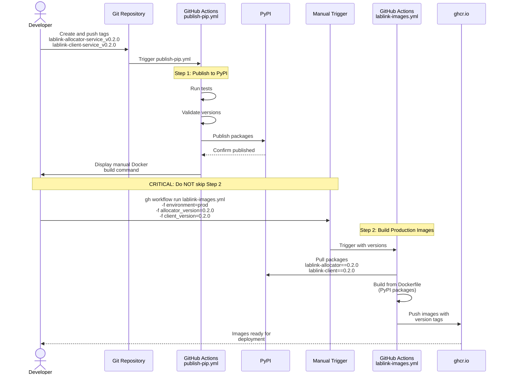

# Workflows

This guide explains LabLink's CI/CD workflows, how they work, and how to customize them.

## Overview

LabLink uses GitHub Actions for continuous integration and deployment. The workflows automate:

- Python package publishing to PyPI
- Docker image building and publishing to GHCR
- Testing and validation (linting, unit tests)
- Documentation deployment to GitHub Pages

**Note**: Infrastructure deployment workflows (OpenTofu) live in the [LabLink Template Repository](https://github.com/talmolab/lablink-template).

## Workflow Files

All workflows are located in `.github/workflows/`:

| Workflow File                                     | Purpose                                  | Trigger                                     |
| ------------------------------------------------- | ---------------------------------------- | ------------------------------------------- |
| [`ci.yml`](#continuous-integration-workflow)      | Linting and unit tests for all packages  | PRs touching `packages/**`                  |
| [`publish-pip.yml`](#package-publishing-workflow) | Publish Python packages to PyPI          | GitHub Releases, git tags, manual dispatch  |
| [`lablink-images.yml`](#image-building-workflow)  | Build and push Docker images to GHCR     | PRs, pushes to `main`/`test`, manual dispatch |
| [`docs.yml`](#documentation-workflow)             | Build and deploy documentation           | Pushes to main, docs changes                |

## Continuous Integration Workflow

**File**: `.github/workflows/ci.yml`

Runs on pull requests that touch `packages/**` (Markdown-only changes are ignored). Two matrix jobs cover all three packages — allocator, client, and CLI:

- **Lint** — `ruff check src tests` in each package.
- **Test** — `pytest` with coverage in each package, against a real PostgreSQL service container. The allocator and client jobs enforce a **90% coverage gate**; the allocator job additionally installs OpenTofu and assumes an AWS role via OIDC so its Terraform tests run for real.

Each job syncs only its own package's dependencies, so a cross-package import that works in the local shared venv can still fail in CI.

Docker builds are exercised by `lablink-images.yml`, which also runs on PRs — not by `ci.yml`.

## Package Publishing Workflow

**File**: `.github/workflows/publish-pip.yml`

### Purpose

Publishes Python packages to PyPI with safety guardrails.

### Triggers

- **GitHub Releases** (published)
- **Git tags** matching a package name pattern (e.g., `lablink-allocator-service_v0.2.0`)
- **Manual dispatch** with dry-run option

A GitHub Release fires both a tag-push run and a release run for the same version; the workflow serializes them so the second run sees the package already on PyPI and skips cleanly.

### Features

- Version verification (prevents republishing same version)
- Metadata validation
- Linting and tests before publishing
- Dry-run mode for testing
- Per-package control (publish allocator, client, or CLI independently)

### Package Versioning

- **Format**: `{package-name}_v{version}`
- **Examples**:
  - `lablink-allocator-service_v0.2.0`
  - `lablink-client-service_v0.2.0`
  - `lablink-cli_v0.1.0`

## Image Building Workflow

**File**: `.github/workflows/lablink-images.yml`

### Purpose

Builds and publishes allocator and client Docker images to GitHub Container Registry (ghcr.io) using either local code (dev) or published packages (prod), then verifies the images work correctly.

### Dev vs. Prod Decision Logic

The workflow selects between the development Dockerfile (`Dockerfile.dev`, local code) and the production Dockerfile (`Dockerfile`, PyPI packages) based on the trigger:

| Trigger             | Environment Input | Dockerfile Used  | Package Source          | Version Required? | Tag Suffix | Use Case                   |
| ------------------- | ----------------- | ---------------- | ----------------------- | ----------------- | ---------- | -------------------------- |
| Pull request        | N/A               | `Dockerfile.dev` | Local code              | No                | `-test`    | CI validation              |
| Push to `test`      | N/A               | `Dockerfile.dev` | Local code              | No                | `-test`    | Staging/testing            |
| Push to `main`      | N/A               | `Dockerfile.dev` | Local code              | No                | `-test`    | Latest development         |
| Manual dispatch     | `test`            | `Dockerfile.dev` | Local code              | No                | `-test`    | Test specific changes      |
| Manual dispatch     | `ci-test`         | `Dockerfile.dev` | Local code              | No                | `-test`    | CI testing with S3 backend |
| Manual dispatch     | `prod`            | `Dockerfile`     | PyPI (explicit version) | **Yes**           | none       | **Production releases**    |

**Key principle**: Production images from PyPI are ONLY created via manual dispatch with `environment=prod` and explicit `allocator_version` and `client_version` inputs — the workflow fails with a clear error if they are missing. All automatic builds (PR, push to `test`/`main`) use local code, include dev dependencies, run verification tests, and always carry the `-test` suffix. Production builds skip tests (the package was tested before publishing) and get clean version tags for traceability.

### Production Release Workflow

**IMPORTANT**: Production Docker images must be built AFTER publishing packages to PyPI. This is a **manual two-step process**:


```mermaid
sequenceDiagram
    actor Developer
    participant Git as Git Repository
    participant GHA as GitHub Actions<br/>publish-pip.yml
    participant PyPI
    participant Manual as Manual Trigger
    participant Build as GitHub Actions<br/>lablink-images.yml
    participant Registry as ghcr.io

    Developer->>Git: Create and push tags<br/>lablink-allocator-service_v0.2.0<br/>lablink-client-service_v0.2.0
    Git->>GHA: Trigger publish-pip.yml

    Note over GHA: Step 1: Publish to PyPI
    GHA->>GHA: Run tests
    GHA->>GHA: Validate versions
    GHA->>PyPI: Publish packages
    PyPI-->>GHA: Confirm published
    GHA->>Developer: Display manual Docker<br/>build command

    Note over Developer,Manual: CRITICAL: Do NOT skip Step 2

    Developer->>Manual: gh workflow run lablink-images.yml<br/>-f environment=prod<br/>-f allocator_version=0.2.0<br/>-f client_version=0.2.0

    Note over Build: Step 2: Build Production Images
    Manual->>Build: Trigger with versions
    Build->>PyPI: Pull packages<br/>lablink-allocator==0.2.0<br/>lablink-client==0.2.0
    Build->>Build: Build from Dockerfile<br/>(PyPI packages)
    Build->>Registry: Push images with<br/>version tags
    Registry-->>Developer: Images ready for<br/>deployment
```

**Step 1: Publish packages to PyPI**

```bash
# Create and push git tags (or publish a GitHub Release)
git tag lablink-allocator-service_v0.2.0
git tag lablink-client-service_v0.2.0
git push origin lablink-allocator-service_v0.2.0 lablink-client-service_v0.2.0

# publish-pip.yml workflow automatically:
#   - Runs tests
#   - Publishes to PyPI
#   - Displays manual Docker build command
```

**Step 2: Manually trigger Docker image build** (required)

```bash
# After packages are published, build production images
gh workflow run lablink-images.yml \
  -f environment=prod \
  -f allocator_version=0.2.0 \
  -f client_version=0.2.0
```

Or via the GitHub UI: [Actions → Build and Push Docker Images](https://github.com/talmolab/lablink/actions/workflows/lablink-images.yml) → "Run workflow" → set environment `prod` and both version inputs.

**Critical**: Do NOT skip Step 2. Without it, your published packages won't have corresponding Docker images, and deployments will fail. Pushing to `main` does NOT create production images — it creates development images with the `-test` suffix from local code.

#### Common Mistakes

**Forgetting to build Docker images after publishing packages**

```bash
# Published to PyPI but forgot Step 2
git push origin lablink-allocator-service_v0.2.0
# Result: Package exists but no Docker image with version tag
```

**Trying to build production images without versions**

```bash
gh workflow run lablink-images.yml -f environment=prod
# Error: Production builds require both allocator_version and client_version
```

**Correct production release**

```bash
# 1. Publish packages
git push origin lablink-allocator-service_v0.2.0 lablink-client-service_v0.2.0

# 2. Wait for publish-pip.yml to complete successfully

# 3. Build Docker images with explicit versions
gh workflow run lablink-images.yml \
  -f environment=prod \
  -f allocator_version=0.2.0 \
  -f client_version=0.2.0
```

### Image Tagging Strategy

Images are `ghcr.io/talmolab/lablink-allocator-image` and `ghcr.io/talmolab/lablink-client-base-image`. Every build pushes a set of tags:

- **Version tags** (`:0.2.0`, `:linux-amd64-0.2.0`) — production builds only. This is what you pin in deployments.
- **`-test` suffix** (`:linux-amd64-test`, `:<sha>-test`) — every automatic/dev build. Never a production image.
- **Git SHA tags** (`:<sha>`) — trace an image back to its commit.
- **Rolling tags** (`:latest`, `:linux-amd64-latest`) — convenience pointers to the most recent build.
- **Metadata tags** — encode the platform and key base-component versions (OpenTofu, PostgreSQL, CUDA) for provenance.

For production deployments, always pin version-specific tags in your OpenTofu configuration:

```hcl
allocator_image_tag = "0.2.0"  # Pin to specific version
client_image_tag    = "0.2.0"
```

For development/testing, use `linux-amd64-test` (dev builds) or `latest`.

## Documentation Workflow

**File**: `.github/workflows/docs.yml`

Builds the MkDocs site and deploys it to GitHub Pages at
[talmolab.github.io/lablink](https://talmolab.github.io/lablink/). Runs on
pushes to `main` and on pull requests affecting `docs/**` or `mkdocs.yml`.

## Troubleshooting Workflows

??? note "Workflow won't trigger"

    **Check**:

    - Workflow file syntax (use YAML validator)
    - Trigger conditions match your action
    - Workflows enabled in repository settings

??? note "Image push fails"

    **Check**:

    - GHCR authentication (should be automatic)
    - Image size limits
    - Registry permissions

## Next Steps

- **[Deployment](deployment.md)**: The template repo's OpenTofu deployment workflows
- **[Contributing](contributing.md)**: Development workflow and release process
