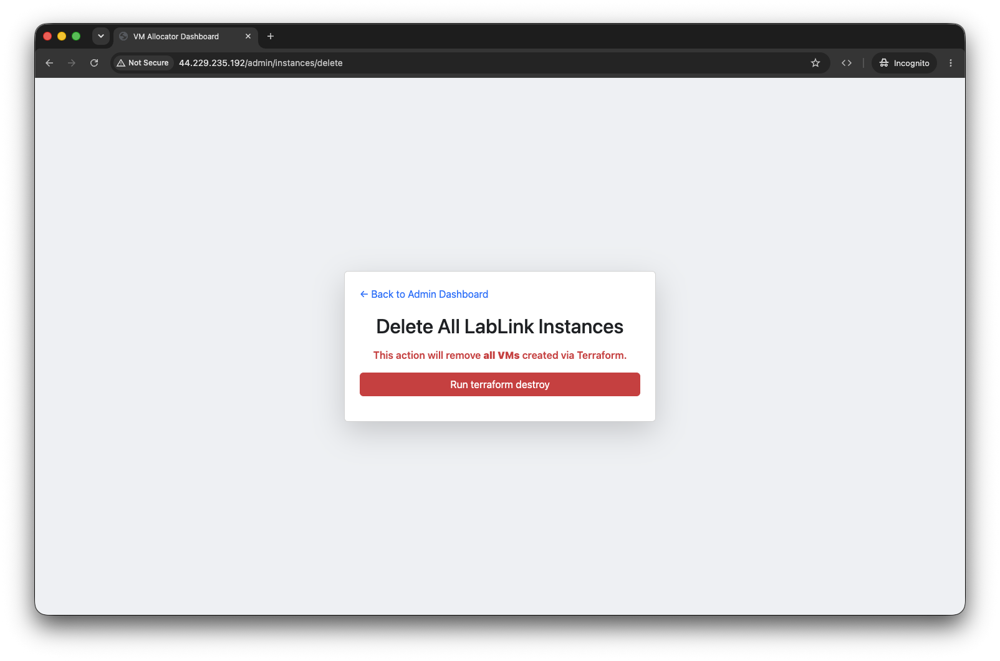

# Workshop Guide

A step-by-step guide for running a hands-on workshop with LabLink, from setup to cleanup.

!!! info "Prerequisites"
    This guide assumes you have already [deployed LabLink](quickstart.md) and [configured it for your software](adapting.md).

## Before the Workshop

### 1. Create VMs

Spin up VMs ahead of time so they're ready when participants arrive. VMs typically
take 5–7 minutes to provision.

1. Open the allocator's **Admin URL** (printed by `lablink status` or shown in the deployment output) and append `/admin`
2. Log in with your admin credentials
3. Click **Create New VM Instance**
4. Enter the number of VMs to launch (one per participant, plus a few extras)
5. Click **Launch VMs**


!!! tip
    Create a few extra VMs beyond your expected headcount. You can always destroy unused ones later, but creating more mid-session takes 5 minutes.

### 2. Verify VMs Are Healthy

Wait for all VMs to show **"running"** status in the dashboard before the workshop begins.


The dashboard shows the following for each VM:

| Column | Description |
|--------|-------------|
| **Hostname** | VM instance identifier |
| **User Email** | Email of the participant assigned to the VM |
| **In Use** | Whether the VM is currently claimed by a participant |
| **VM Status** | Overall VM status (`running`, `initializing`, `error`, or `rebooting`) |
| **GPU Health Status** | GPU availability and CUDA status |
| **Total Startup Duration** | How long the VM took to become ready |
| **Logs** | Link to view startup and runtime logs for the VM |
| **Access** | Per-VM actions such as Peek, Connect, Release, and Clear Unhealthy |

!!! warning "What if a VM is stuck?"
    The recovery service checks error and unhealthy VMs, initializing VMs stuck for more than 25 minutes, rebooting VMs stuck for more than 10 minutes, and running VMs silent for more than 3 minutes. Check the VM logs for details.

### 3. (Optional) Schedule Auto-Destruction

If your workshop has a fixed end time, schedule VMs to be automatically destroyed:

1. Set the desired destruction date and time in the admin panel
2. Confirm the schedule


This is useful as a safety net to avoid leaving VMs running (and incurring costs) if you forget to clean up manually.

## Share with Participants

### What to Share

Give participants the allocator URL:

```
    The allocator's **Admin URL** or public URL printed after deployment
```

Or if you configured DNS:

```
https://lablink.yourdomain.com
```

### What Participants Do

1. Visit the URL in their browser
2. Enter their email address
3. The allocator assigns them a VM and drops them straight into its desktop
4. The desktop opens in the browser tab with your software pre-installed

No installation, no setup -- participants only need a browser.

## During the Workshop

### Monitor the Dashboard

Keep the admin panel open to track participant activity:


- **VM Status** column shows if VMs are running normally
- **GPU Health Status** confirms GPU availability for compute workloads
- **In Use** shows which VMs have been claimed
- **User Email** shows who is using each VM

### Adding More VMs

If more participants arrive than expected:

1. Click **Create New VM Instance** in the admin panel
2. Enter the additional number needed
3. Click **"Launch VMs"**

New VMs are created without affecting existing running VMs. They typically take
5–7 minutes to become ready.

### Handling Issues

- **VM shows "error"**: The auto-reboot service will attempt to recover it automatically (up to 3 times). Check the logs link for details.
- **Participant can't connect**: Verify their VM shows "running" status and that they were assigned one. Try having them reload the allocator page to get a fresh session.
- **All VMs assigned**: Create additional VMs as described above.

## End of Workshop

### Destroy VMs

!!! warning "Participant files are not recoverable"
    LabLink does not collect work off the VMs. Tell participants to download
    anything they want to keep before the session ends -- destroying a VM
    destroys its disk.

Tear down all VMs:

1. Click **Delete VMs** in the admin panel
2. Click **"Run tofu destroy"** and confirm



This starts an asynchronous operation that terminates all client EC2 instances
and clears VM records from the database. Watch the job banner until it finishes.

## After the Workshop

### Destroy the Allocator (Optional)

If you don't need LabLink running until your next workshop, destroy the allocator infrastructure to stop incurring costs:

=== "Via GitHub Actions"

    Run **Destroy LabLink Infrastructure** from the Actions tab with the
    original `deployment_name` and `environment`, and set `confirm_destroy` to
    `yes`.

=== "Via OpenTofu"

    ```bash
    cd lablink-infrastructure
    ../scripts/init-terraform.sh test
    tofu destroy -var="deployment_name=YOUR-DEPLOYMENT" -var="environment=test"
    ```

See [Deployment](deployment.md#destroying-a-deployment) for details.

### Review Costs

Check [Cost Estimation](cost-estimation.md) for guidance on reviewing your AWS bill and optimizing costs for future workshops.

## Related

- [API Endpoints](api-endpoints.md) for programmatic access to admin features
- [Configuration](configuration.md) for admin password and app settings
- [Security & Access](security.md) for authentication details
- [Troubleshooting](troubleshooting.md) for common issues
