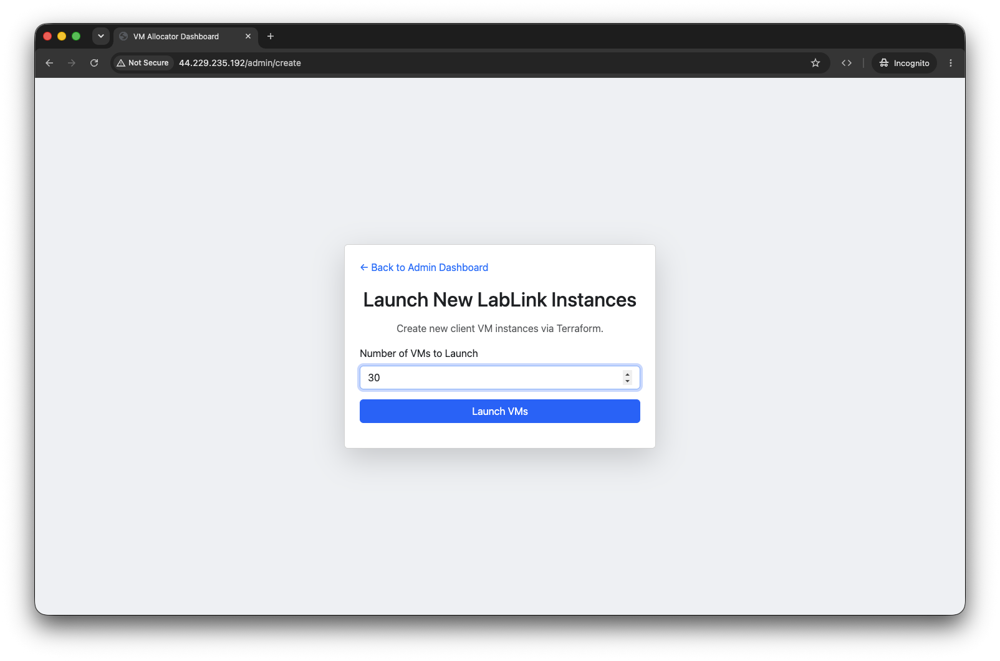
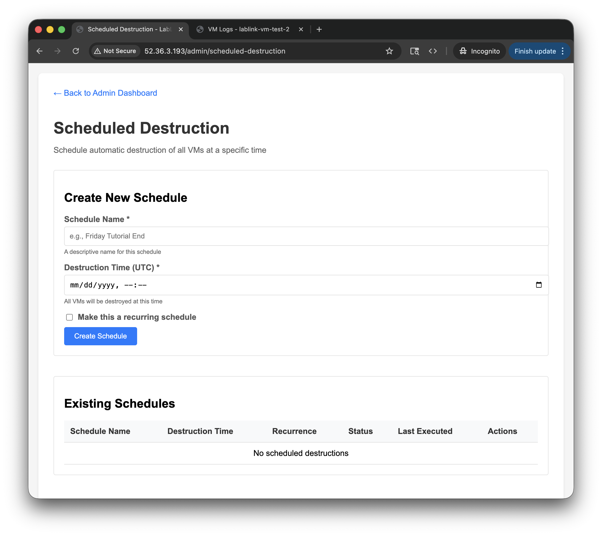

# Workshop Guide

Prepare client machines before participants arrive, watch their health during
the session, and remove them afterward. This guide assumes you have
[deployed LabLink](quickstart.md) and [configured the client software](adapting.md).

## Before the Workshop

### 1. Create VMs

For an AWS deployment, open the printed **Admin URL** and choose **Create
New VM Instance**. On the **Launch New LabLink Instances** page, enter the
number of participants plus a few spare seats and click **Launch VMs**.
The request queues an OpenTofu job; the dashboard shows its progress. Recent
workshop measurements put a client boot around 5–7 minutes, so launch ahead
of the start time.



From the CLI, the equivalent is:

```bash
lablink client launch --num-vms 5
lablink status
```

With `provider: manual`, register each box instead; see
[Bring-Your-Own Clients](cli/byo-clients.md#step-4-register-each-box).

### 2. Verify VMs Are Healthy

Wait for each client to report `running` and check its `Healthy` value and
logs. `Status` can be `initializing`, `running`, `error`, or `rebooting`;
`unknown` is accepted by the status endpoint but not currently written.
`InUse` records whether the configured software is running, not whether a
participant holds a seat. `UserEmail` is the assignment field.


The per-VM actions are **Peek (view-only)** for an assigned session,
**Connect (VNC)** for an unassigned running VM, **Release** for an admin
reservation, and **Clear Unhealthy** when that flag is set. There is no
per-VM reboot or destroy button.

For a VM with errors, open its logs or use `lablink logs`. The AWS auto-reboot
sweep runs every 60 seconds and considers error or unhealthy VMs,
`initializing` for more than 25 minutes, `rebooting` for more than 10 minutes,
and silent heartbeats for more than 3 minutes. It tries up to three reboots;
the seat is released if attempts are exhausted.

### 3. Optionally Schedule Destruction

The admin scheduling page asks for a schedule name and a **UTC** destruction
time, with optional recurrence. A schedule is a backstop for a workshop with
a fixed end time. Check that its time and recurrence match your event before
leaving it active.



## Share with Participants

Share the allocator's participant URL, using the domain and HTTPS mode you
configured. Participants open it in a browser, enter their email, and receive
an available desktop. Ask them to download work they need to keep before
client VMs are destroyed; LabLink does not collect their files automatically.

## During the Workshop

Keep the admin dashboard open to track `Status`, `Healthy`, `UserEmail`, and
`InUse`. The **Allocator Logs** page and `lablink logs` help diagnose startup
or connection problems. Use **Create New VM Instance** or
`lablink client launch --num-vms N` if the pool is short; existing sessions
continue while the new job runs.

If a participant cannot connect, check that their VM is `running`, whether
it is `Unhealthy`, and whether a seat is assigned. After resolving a
transient issue, a participant can reload the allocator page to get a fresh
session. See [Troubleshooting](troubleshooting.md) for deeper checks.

## End of Workshop

### Destroy VMs

Ask participants to save their files first. In the admin dashboard, choose
**Delete VMs**, then **Run tofu destroy** and confirm. The request starts an
asynchronous operation; watch the job banner until it finishes. This
terminates AWS client VMs and clears their database records.

The CLI equivalent is:

```bash
lablink client destroy
lablink status
```

For BYO clients, run `lablink client unregister` on each box instead.

## After the Workshop

Destroy the allocator if you no longer need it. For a CLI deployment, run
`lablink destroy`. For a template deployment, run **Destroy LabLink
Infrastructure** with the original `deployment_name` and `environment`, and
set `confirm_destroy` to `yes`. See
[Deployment](deployment.md#destroying-a-deployment).

Review actual AWS charges in Cost Explorer and use
[Cost Estimation](cost-estimation.md) to plan the next workshop.
